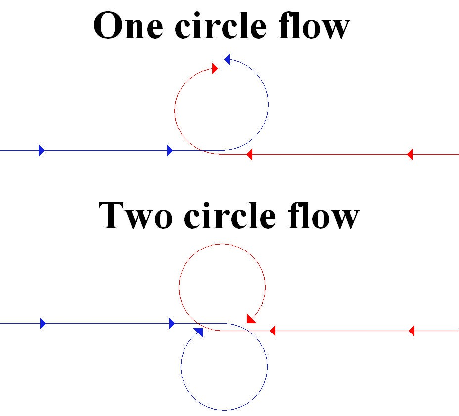
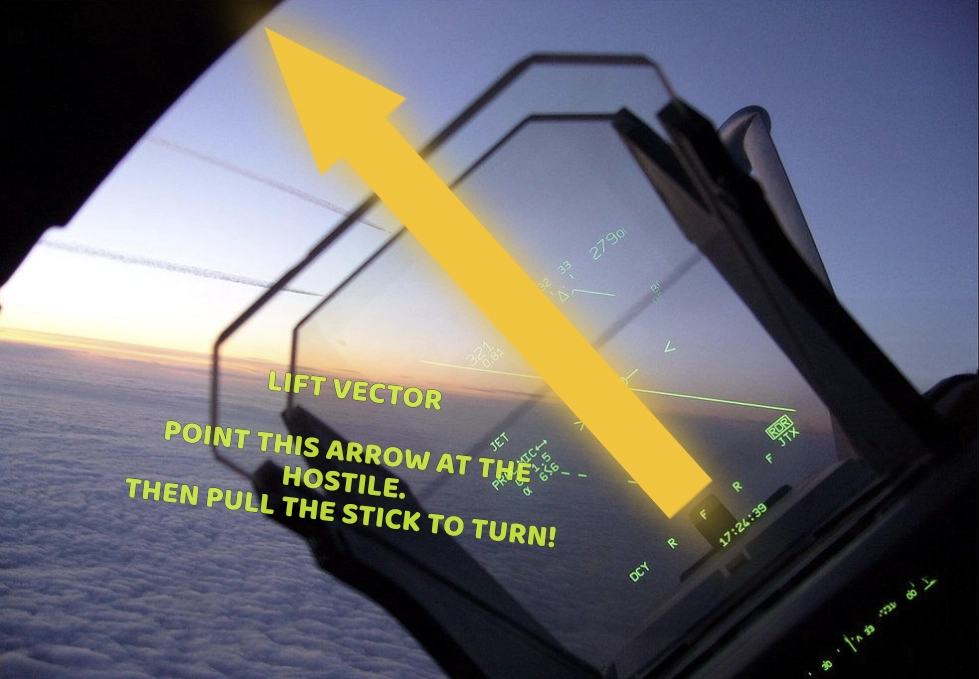

_Work in Progress_

This is a quick introductory guide to Basic Fighter Maneuvers (BFM), also called dogfighting.

BFM/Dogfighting specifically means close range fighting (usually within 5-10 nautical miles).

BFM is fun to practice, and a great way to build piloting skills. However, it is a _losing_ strategy in most missions, because it negates most of your technological advantages and evens the playing field with the enemy. If you want to win fights, you should study [BVR combat](../../dcs/content#bvr-timeline).

This guide is intended for absolute beginners to begin dogfight training within a few minutes. It is not a comprehensive guide, nor a guide intended to make you an ace pilot. You must **practice**, **debrief**, **study**, and **practice again** to achieve that.

_This guide includes contributions from my friend Marlan._

## Energy is Life

In a dogfight, energy is your life bar. You have two forms of energy:

- Kinetic Energy: **Speed**. If you maintain your aircraft's optimal speed, you will be able to make the tightest possible sustained turn, which helps you kill your enemy before they can kill you.
- Potential Energy: **Altitude**. If you're at a high altitude, enemy planes and missiles below you need to spend energy to reach you, and your own missiles spend less energy to reach enemies at or below your altitude.

If you have excess kinetic energy, you can climb to convert it to potential energy; if you need more kinetic energy, you can dive to convert potential energy back to kinetic energy.

If you run out of both kinetic and potential energy, you will be killed.

## Keep Your Eyes On the Enemy

In a fight, you will need to keep your eyes locked on the enemy aircraft at all times. If you look down at your instruments or controls for even a second, you can lose sight of the enemy. This puts you in extreme danger.

You will need to be comfortable using your weapons and managing your airspeed without looking down. If your aircraft has a helmet-mounted display, this will be a little easier. Regardless, you need to practice this skill offline or with a sparring partner, so that you will be ready to use it in combat.

If you cannot see the enemy, assume they are directly behind you and about to fire an IR missile. Dispense flares and keep maneuvering. Don't ever fly straight and level when an enemy is near and not tracked!

## Phases of a Fight

You can break a 1v1 dogfight down into phases:

- Pre-merge: The aircraft are approaching each other.
- Merge: The aircraft pass close to each other.
- Fight: The aircraft compete to turn better than each other to set up a kill shot.

**In a mission, you should do everything you can to win before the merge.** The merge is an extremely dangerous moment because the enemy gets a free opportunity to shoot you at close range, where evading or flaring the enemy's shot is very difficult. It is the most likely time you will die. Don't give the enemy an easy shot; come at them from an angle or above, not head on, and try to set up a good missile shot to kill them during pre-merge.

In training, you and your sparring partner will typically agree on rules on when shooting is allowed or prohibited, based on what you are practicing.

## Rate Fight

Once past the merge, you will usually enter a turning fight. You will bank your aircraft so that your lift vector intersects the enemy, and then pull the stick to turn. Your goal is to turn towards the enemy at the optimal rate, setting up a kill shot. If you pull too hard on the stick, you'll bleed too much speed and lose maneuverability. If you don't pull hard enough, you won't turn fast enough to catch the enemy.

To find your aircraft's optimal turn rate, use an Energy-Maneuverability Diagram. A user named "Contact Light" computed and published E-M diagrams for many DCS aircraft in 2023. I have mirrored the diagrams PDF [here](docs/em.pdf). The key number is the _maximum sustained turn speed_. The exact number varies with altitude/pressure. You should memorize this number at several altitudes that you expect to fight at.

For quick reference, here is a table of approximate Sustained Turn Speeds for some popular aircraft. These err on the slightly slow side to give beginners more margin of error, at the tradeoff of slightly suboptimal turn rate. Higher speeds can provide a slightly better turn rate, but going too fast while turning can result in a rapid and catastrophic loss of energy.

Module|Speed
-|-
F-14B†|330 kts
F-15C|400 kts
F-15E|350 kts
F-16C|400 kts
F/A-18C|350 kts
MiG-29A|750 kph
Su-27|750 kph
Su-33|750 kph

† Roll SAS should be OFF. Flaps should be UP. Wing sweep should be AUTO. Use rudder inputs to roll.

If this table is too much to remember, just use 350 kts for US fighters and 750 kph for Soviet fighters. It's close enough for video games.

When in the turn phase of a fight, place your throttle in afterburner and keep it there. Then pull your stick to stay as close as you can to the max sustained turn rate as possible. If you're too slow, pull the stick less until you reach the target speed. If you're a little too fast, pull the stick more until you reach the target speed. If you're way too fast, try climbing to convert the excess speed into altitude you can spend later if needed.

_Note: Third-gen interceptors such as the MiG-21 and F-4E will find it difficult to sustain level turns due to their smaller wings and emphasis on speed over maneuverability. These older machines fight using different tactics such as slashing attacks, boom and zoom tactics, and "The Egg", an elliptical turn designed to exploit the F-4E's strengths against the MiG-21's weaknesses. Play the MiG Killers campaign to learn more!_

## Kill the Enemy

Once you have a kill shot lined up, **kill the enemy**. Usually this means getting directly behind them and firing an infrared missile up their tailpipe. If you are in a newer aircraft you might have all-aspect missiles like the AIM-9X that can kill from weird angles. You might also have a helmet-mounted display that lets you lock on to enemies way outside your HUD. These are great to have, and you should learn how to use these tools if available, but ultimately what matters is that you **kill them** before they kill you.

## Practice

The best way to practice these skills is to spar with a human better than you and debrief every fight. This will teach you more in an evening than you would learn on your own in a year.

Record your fights using [Tacview](https://www.tacview.net/). The free version of Tacview works well for this purpose. Spend 15 minutes debriefing in Tacview for every 5 minutes you spend fighting in the sim.

The default AI in DCS blatantly cheat and defy the laws of physics; you will learn bad habits trying to learn by fighting them.

For the F-14 and F-4, you can also learn these skills in singleplayer by playing the campaigns [Speed & Angels](https://www.digitalcombatsimulator.com/en/shop/campaigns/f-14_speed_and_angels_campaign/) and [MiG Killers](https://www.digitalcombatsimulator.com/en/shop/campaigns/f-4_mig_killers_campaign/). These campaigns use custom-scripted AI instead of the default cheater AI. I strongly recommend these campaigns; they're some of the best gameplay in DCS.

## Further Learning

*Art of the Kill* by Pete Bonanni



*The Ops Center* by Mike Solyom



*Debrief BFM Guides* By Air Warfare Group



*The Air Combat Tutorial Library* by Requiem



*Speed & Angels* campaign by Reflected



*Mig Killers* campaign by Reflected



_Fighter Combat: Tactics and Maneuvering_ by Robert L. Shaw

[Google Books](https://books.google.com/books?id=hBxBdKr0beYC)

[CNATRA P-826: Flight Training Instruction, Basic Fighter Maneuvering (BFM)](https://web.archive.org/web/20220509033047/https://www.cnatra.navy.mil/local/docs/pat-pubs/P-826.pdf)
