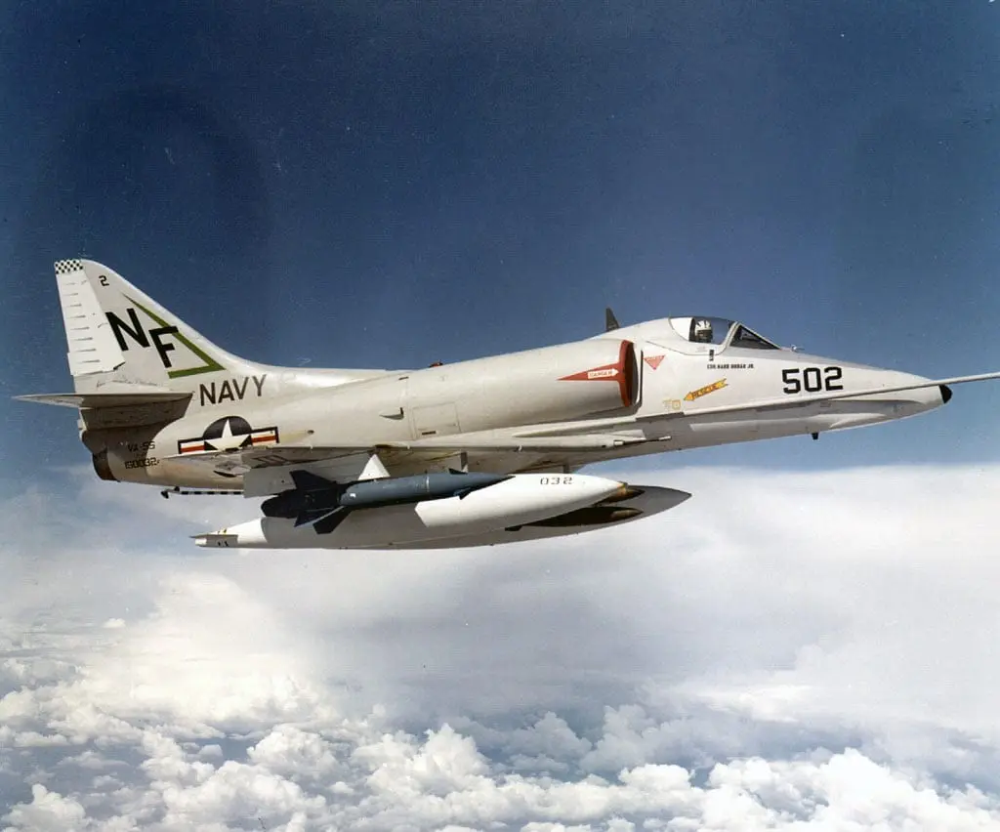
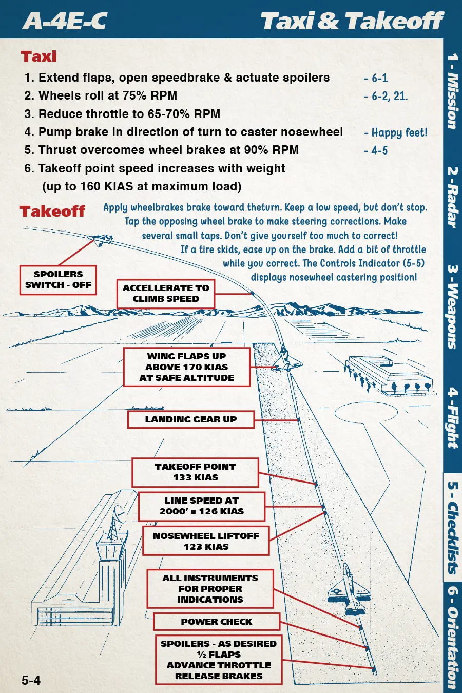
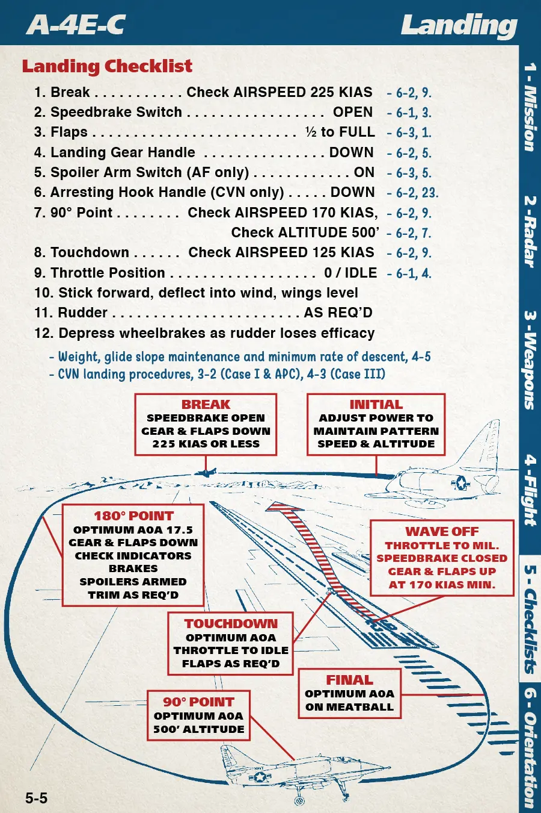
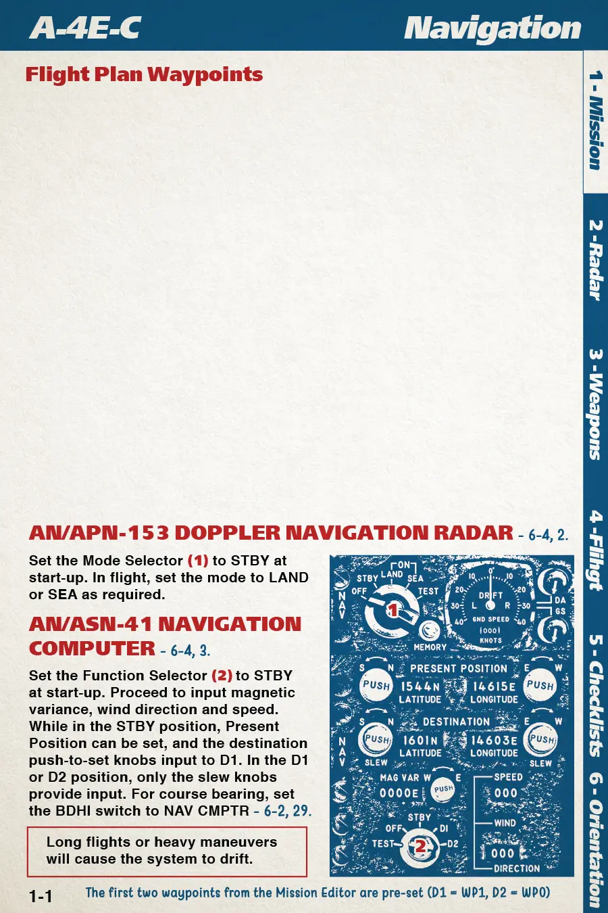

The A-4 Skyhawk is a naval light attack plane introduced in the 1950s. It served the US in a combat role, most notably during the Vietnam War. It was also operated by the IDF in the Yom Kippur War, Argentina in the Falklands War and the Free Kuwaiti Air Force during Operation Desert Storm. The US continued to use it in a training role until the early 2000s. It is notable for its light weight, agility, toughness, ease of maintenance, and low cost. It is best suited for low-level ground attack and strike missions using guns, rockets, and bombs. It was also used as an adversary aircraft for air-to-air combat training at TOPGUN.

# Installation

Download the latest version at [https://heclak.github.io/community-a4e-c](https://heclak.github.io/community-a4e-c/). Download the ZIP file and extract it to `%userprofile%\Saved Games\DCS\Mods\aircraft\A-4E-C`.

The folder will look like this when correctly installed:

# Controls

## Essential on HOTAS

- Pitch - Recommend curve of 10-20
- Roll - Recommend curve of at least 20
- Throttle
- Rudder
- Trim Switch
- Gun-Rocket Trigger
- Bomb Release Button
- JATO Firing Button (Countermeasures burst)
- Landing Gear Handle

## Nice to Have on HOTAS

- Wheel brake left/right (or single Wheel Brake binding with OPTIONS > SPECIAL > A-4E-C > Simple Braking enabled)
- Zoom in Slow and Zoom out Slow (or Zoom View axis on slider)
- Gunsight Elevation
- Antenna Tilt Switch
- Speedbrake Switch
- Flap Handle
- Spoiler Arm Switch
- Chaff AUTO Pushbutton (Countermeasures salvo)

## Essential Keyboard Commands

- RShift+K: Kneeboard
- [ and ]: Turn kneeboard page
- Backspace: Show/hide stick 3D model
- LCtrl+W/LAlt+W/W: Hold for wheel brake left/right/both
- L: Master exterior light switch
- 1/2/3/4/5: Station 1-5 Selectors
- 7/8: Weapon Function Selector Switch
- G: Toggle landing gear
- S: Toggle spoilers
- LCtrl+F/LShift+F: Flaps down/up (hold)
- LCtrl+B/LShift+B: Toggle speed brake

## Autopilot Keyboard Commands

- A: AFCS Engage/Off (autopilot master switch)
- LShift+A: AFCS Altitude Switch On/Off (autopilot altitude hold)
- LShift+LCtrl+A: AFCS Heading Select Switch (autopilot heading hold)

# Flight Procedures



## Startup

1. Request ground power from crew chief (Comm → F8, F2, F1)
2. Engine start switch (large button aft of throttle) press and hold until RPMs rise
3. Wait for 5% engine RPM, then right click throttle to advance to IGN detent
4. Wait for 15% engine RPM, then right click throttle to advance to IDLE detent
5. Wait for 40% engine RPM, then request crew chief disconnect ground power (Comm → F8, F2, F2)
6. Wait for 55% engine RPM, 35-50 PSI engine oil pressure, 200-340C exhaust temperature
7. Close canopy after any refueling/rearming is complete

## Pretaxi

1. Close canopy (yellow lever on right side)
2. UHF radio on right side as desired (3m warmup)
    1. Mode switch to T/R or T/R+G as desired
    2. Frequency mode to MAN or PRESET as desired
    3. PRESET CHAN dial or MC dials as desired
3. TACAN on right side as desired (3m warmup)
    1. Large outer dial for 10s digit
    2. Small inner dial for 1s digit
    3. Mode switch to REC, T/R or A/A as desired
4. AFCS standby switch on left side to STANDBY (90s warmup)
5. Barometric altimeter on left side of dash set air pressure per conditions
6. Doppler Navigation Radar Mode Selector on right side to STBY (5m warmup)
7. Navigation Computer on right side as desired (or skip and use F10 map)
    1. Function Selector to STBY (2m warmup)
    2. Function Selector to D2
    3. Set D2 (second waypoint) destination using slew knobs
    4. Function Selector to STBY
    5. Set D1 (first waypoint) destination using slew knobs or push-to-set knobs
    6. Set PRESENT POSITION using push-to-set knobs (preset for newly spawned aircraft, but might be necessary if restarting or of carrier has moved)
    7. Input magnetic variation (preset for most maps, but might be necessary for newly released maps)
    8. Input wind direction and wind speed if not using Doppler Navigation Radar
8. Oxygen switch on left side at rear to ON
9. Exterior lights as desired
    1. Pinky switch on throttle ON or L key
    2. Exterior lighting controls along right edge of cockpit

## Taxi

The A-4E does not have nosewheel steering, instead the nose wheel freely casters like a shopping cart wheel and differential braking is used to steer. This will take practice. Consider simplified steering option in SPECIAL options

1. Throttle up to 75% RPM to start aircraft rolling
2. Reduce throttle to 65-70% after rolling starts. DO NOT STOP!
3. Apply brakes in direction you want to steer (left brake to go left, right brake to go right). If using rudder pedals, use analog braking. If using keyboard, pump the brakes (LCtrl+W for left, LAlt+W for right).

## Pretakeoff

1. Check nosewheel is straight
2. Navigation Computer Function Selector to D1 or D2 as required
3. AFCS stability augmentation switch on left side to STAB AUG
4. Chaff power switch on left dash eyebrow to PWR
5. RHWS  (Electronic Countermeasures) on left eyebrow as required 
    1. APR 25 switch to APR 25
    2. Audio ALQ switch to AUDIO ALQ
    3. Function Selector to REC
    4. MSL ALERT volume knob as desired
    5. PRF volume knob as desired
6. Trim nose to 8 up and aileron to 0 (see NOSE gauges on left side)
7. Flaps to 1/2 (See flaps gauge on right side)

## Takeoff

1. Hold brakes, spool engine to 90% RPM, release brakes
2. Nosewheel lifts off ~120KIAS
3. Takeoff ~130-160KIAS depending on weight
4. Gear up promptly
5. Flaps up at 170KIAS

## Departure

1. Doppler Navigation Radar Mode Selector on right side to LAND or SEA as required
2. Navigation Computer Function Selector to D1 or D2 as required over starting point
3. BDHI as required 
4. Radar Altimeter on/off and adjusted as required

## Airfield Approach and Landing

1. Reduce airspeed to 225KIAS
2. Speedbrakes OPEN
3. Flaps 1/2 to FULL
4. Gear down
5. Spoiler arm switch ON or Arresting Hook DOWN
6. Reduce speed further to below 170KIAS
7. Use pitch for AoA and throttle for descent rate. It’s hard to see the runway when on glide slope. Practice is necessary. If anything looks wrong, do not try to save it, go around!
8. Touchdown speed 125KIAS
9. Push nose down into tarmac after touchdown for traction.
10. Throttle to IDLE, then transition to brakes

# Navigation Computer Procedures

1. Set AN/ASN-41 computer function selector to STBY
2. Set PRESENT POSITION to navigation fix
3. Set DESTINATION to D1 coordinates
4. Overfly navigation fix
5. Set function selector to D1
6. Set AN/APN-153 Doppler radar mode selector to LAND or SEA as required
7. Set BDHI to NAV CMPTR

# Weapon Procedures



## Bombs

1. Armament Panel as required
    1. Master Arm ON
    2. Station Selector Switches as required
    3. Bomb Arm Switch to NOSE & TAIL
    4. Weapon Function Selector Switch to BOMBS & GM ARM (manual) or CMPTR (bombing computer)
        1. CMPTR: AN/APG-53A Radar Mode Switch on left side to A/G
        2. CMPTR: AN/APG Radar on dash gain knob as required
2. Mode Selector Switch: As desired. STEP SINGL is one press, one release. STEP PAIRS is one press, one pair released from paired stations. STEP SALVO is one press, release everything. RIPPL modes will perform multiple “pulses” of releases as configured by QTY and DROP INTVL.
3. QTY Selector Switch: As desired (number of bombs per pulse)
4. DROP INTVL: As desired, minimum 80ms (interval between pulses)
5. MULT SW: As desired (1x or 10x interval)
6. Configure gunsight or bombing computer
    1. For manual bombing, reference kneeboard section 3 for gunsight elevation.
    2. For computer bombing, reference kneeboard pages 3-2 and 2-6 for computer usage.



## Rockets

1. Armament Panel as required
    1. Master Arm ON
    2. Station Selector Switches as required
    3. Weapon Function Selector Switch to GM UNARM or ROCKETS
2. Mode Selector Switch: As desired (recommend RIPPLE SINGL or RIPPLE PAIRS)
3. QTY Selector Switch: As desired (number of rockets per pulse)
4. DROP INTVL: As desired, minimum 80ms (interval between pulses)

Reference kneeboard page 3-3 for gunsight elevation and fire mode usage.

## Gun

1. Armament Panel as required
    1. Master Arm ON
    2. Guns Charging Switch READY (right click)

Reference kneeboard page 3-4 and 3-5 for gunsight elevation and gun usage

## Gunpods

Armament Panel as required

1. Master Arm ON
2. Gun Pod Panel on left side as required
    1. LH/CTR/RH Gunpod station switches as required
    2. Gunpod switch to CHARGE (right click)

Reference kneeboard page 3-4 and 3-5 for gunsight elevation and gun usage

## AGM-54 Shrike Anti-Radiation Missile

1. Armament Panel as required
    1. Master Arm ON
    2. Station Selector Switches as required
    3. Weapon Function Selector Switch to BOMBS & GM ARM
    4. VOL as required
2. Point missile’s boresight within 3° cone towards target, wait for loud tone

## AIM-9 Sidewinder Air-to-Air Missile

1. Armament Panel as required
    1. Master Arm ON
    2. Station Selector Switches as required
    3. Weapon Function Selector Switch to BOMBS & GM ARM
    4. VOL as required
2. Point missile’s boresight towards rear aspect of target, wait for loud tone
