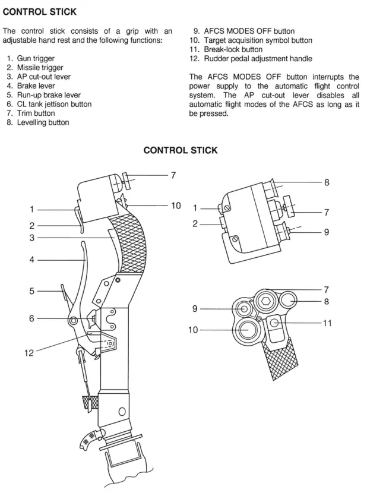

# Introduction

The Mikoyan MiG-29 “Fulcrum” is a Soviet-designed 4th generation fighter that first entered service in 1983. The Fulcrum was intended as an “Advanced Lightweight Tactical Fighter”, a high-speed air superiority fighter that could operate from austere runways to protect the battlefield’s frontline. It is, roughly speaking, the Soviet counterpart to the F-16. 

Downgraded versions were widely exported to the Warsaw Pact and other nations. MiG-29 variants have seen combat in Iraq, Iran, Kuwait, Yugoslavia, Croatia, Kosovo, Kashmir, Sudan, Georgia, Syria, Libya, and Ukraine. Once feared as one of the most agile and dangerous fighters ever made and a threat to the free world, the MiG-29 is now an aging platform- and an a unexpected symbol of resistance against Russian aggression. 

> 📰 [The Truth About the MiG-29](https://www.smithsonianmag.com/air-space-magazine/truth-about-mig-29-180952403/): A fantastic article on the MiG-29’s history.

> 📷 [Fabulous Fulcrums](http://fabulousfulcrums.de/): A cool website of former Luftwaffe Fulcrum pilot.

The MiG-29 is one of the fastest aircraft in DCS World - certainly the fastest player aircraft available to REDFOR - and the earliest to have a helmet-mounted sight for off-boresight missile employment. Although surpassed in capability by modernized 4th-and 5th-generation fighters, it remains an iconic aircraft.

# Variants in DCS

## MiG-29A

Variant based on the MiG-29 9.12 production version operated by Russia during the 1980s and 1990s.

This variant is a common sight in DCS Cold War servers.

## MiG-29G

Variant based on the MiG-29 9.12A Warsaw Pact export variant, specifically the export model operated by the German Democratic Republic until 1990, then by the Federal Republic of Germany until 2004, and finally the Polish Air Force until 2023.

In DCS, this variant is identical to the MiG-29A except the avionics use imperial units (feet and nautical miles) instead of SI units (meters).

## MiG-29S

Variant based on the MiG-29 9.13S, an upgraded version of the MiG-29.

In DCS, this variant has additional features:

1. R-77 (AA-12 Adder) missiles
2. Gardeniya ECM station (jammer pod)
3. “TWS2” radar mode which supports tracking and firing on two targets at once.
4. Slightly larger fuel tank

<aside>
ℹ️ In real life, the 9.13S has a different flight control system and flight envelope from the 9.12. This is not implemented in DCS - the MiG-29A, MiG-29G and MiG-29S all have identical flight models.

</aside>

# Recommended Mods

## Clickable Cockpit

The [Clickable FC3](https://github.com/RedK0d/CLICKABLE-FC3) mod is strongly recommended. It does not transform the FC3 MiG-29 into a full fidelity module, but it does map keyboard commands to clickable regions of the cockpit. This reduces the number of keyboard keys you need to memorize; it’s especially useful for startup, lighting and individual autopilot modes.

> 🖱️ **This guide assumes the Clickable FC3 mod is installed.**

## English Cockpit

If you don’t want to learn the Cyrillic alphabet, the English Cockpit Mod relabels all cockpit instruments in English. The original mod is no longer compatible with DCS 2.9, but I’ve uploaded a working tweaked version.

[MiG-29 English Cockpit.zip](https://download.8492sqdn.net/MiG-29_English_Cockpit.zip)

After installing the `Cockpit_MiG29(A,G,S)` folders in `%userprofile%\Saved Games\DCS\Liveries\`, navigate to options → SPECIAL → Flaming Cliffs or MiG-29 to select the English cockpit option.

> 🇺🇸 **The author does not know the Cyrillic alphabet, so this guide uses English labels and terms.**

## Kneeboards

[DCS Reference Guide](https://www.digitalcombatsimulator.com/en/files/3318384/) - A few pages in here are useful for quickly looking up landing weight, V-speeds, weapons data and a visual guide to the SPO-15.

[Aerodrome Data and Frequencies](https://www.digitalcombatsimulator.com/en/files/3312200/) - this includes a table mapping the airfield IDs in the Return and Landing submodes to the airfield names, which is useful if you ever need to divert to a different airfield.

# Controls

For the curious, here is the real-world control layout of a German MiG-29. Note that the MiG-29 does not follow the HOTAS design philosophy- important buttons are scattered over the controls and cockpit. Bind your controls however you see fit.

Essential controls to bind to the HOTAS are in **bold with a** ⭐.

> 🖱️ This binding list assumes you have installed the Clickable FC3 mod. It excludes some infrequently used actions that are accessible using the mouse, such as some startup steps and lighting controls.

## Flight Controls

| Action | Function | Notes |
| --- | --- | --- |
| ⭐Pitch | Pitch control |  |
| ⭐Roll | Roll control |  |
| ⭐Thrust | Engine power | Set curve using https://pbzweihander.github.io/dcs-detent-finder/ |
| ⭐Rudder | Yaw, ground steering |  |
| Nose Wheel Steering | Hold for high-range steering | Low-range steering is always on |
| ⭐Wheel Brake (axis) or Wheel Brake On | Ground brakes | Real aircraft uses hand brake |
| Wheel Brake Start | Brake with additional pressure. Used for short takeoffs only. | Separate binding from wheel brake. |
| ⭐Landing Gear Up/Down | Lower/raise landing gear | No weight on wheels safety! |
| ⭐Trim Hat | Trim aircraft |  |
| Trim Reset | Set takeoff trim |  |
| ⭐Jettison Fuel Tanks | Drop centerline fuel tank | Airbrake will not deploy if centerline fuel tank is on aircraft |
| Airbrake On/Off | Deploy/retract airbrake |  |
| Flaps | Lower/raise flaps | Only Up and Landing positions are available |
| ⭐Dragging Chute | Deploy drogue parachute, or detach a deployed drogue parachute |  |
| Engines Start | Start both engines in sequence | If your HOTAS has engine start/stop controls, use those instead. |

## Navigation

| Action | Function | Notes |
| --- | --- | --- |
| Next Waypoint, Airfield or Target | Select next waypoint | Used in Return/Landing submodes to select airfield ID for ILS |
| Previous Waypoint, Airfield or Target | Select next waypoint | Used in Return/Landing submodes to select airfield ID for ILS |

## Autopilot

| Action | Function | Notes |
| --- | --- | --- |
| Autopilot - Barometric Altitude Hold | Engage/disengage altitude hold |  |
| Autopilot - Attitude Hold | Engage/disengage attitude hold | Combing with altitude hold for heading hold |
| Autopilot - Ground Collision Avoidance | Engage/disengage GCAS |  |
| ⭐Autopilot - Transition To Level Flight Control | Engage altitude and attitude hold |  |
| Autopilot Override | Disengage autopilot while held, release to reengage |  |
| ⭐Autopilot Reset | Reset autopilot modes |  |

## Master Modes

<aside>
ℹ️ Modes 6 (Fi-Zero) and 8 (Fixed Sight) are backup systems which are not useful in DCS.

</aside>

| Action | Function | Notes |
| --- | --- | --- |
| (1) Navigation Modes | Select Route, Return and Landing (ILS) modes | Used to program ILS |
| ⭐(2) Air-to-Air Beyond Visual Range Modes | Select Scan mode | Primary BVR mode
Allows transition to TWS, TWS2 and STT modes |
| ⭐(3) Close Air Combat Vertical Scan Mode | Select Vertical Scan mode | Primary WVR mode |
| (4) Close Air Combat Bore Mode | Select Bore mode | Situational WVR mode
Can lock at slightly longer range than Vertical Scan |
| ⭐(5) Close Air Combat HMD Helmet Mode | Select helmet mounted sight | Essential for dogfighting. Killer feature of the MiG-29. |
| (7) Air-to-Ground Modes | Select Air-to-Ground Mode |  |

## Sensors

| Action | Function | Notes |
| --- | --- | --- |
| ⭐Radar on/off | Turn radar on or off |  |
| ⭐Electro-optical system on/off | Turn EO system on or off |  |
| ⭐TDC slew (axis) or Target Designator (buttons) | Radar cursor |  |
| ⭐Target Lock | Lock onto target under radar cursor or in HUD frame |  |
| ⭐Return to Search | Unlock locked target |  |
| ⭐Radar Vertical (axis) or Scan Zone Up/Down (buttons) | Radar elevation |  |
| Scan Zone Left/Right | Radar azimuth | Situationally useful. Infrequently used when working with a GCI. |
| ⭐Radar Display Zoom In/Out | Radar display zoom level |  |
| ⭐Radar Range (axis) or Predicted Target Range Increase/Decrease (buttons) | Vertical scan volume | Analogous to the 1B/2B/4B scan volume setting in western radars. |
| Radar RWS/TWS Mode Select | Toggle Range While Scan and Track While Scan | RWS IS FINE. You can probably just leave the radar in RWS. |
| Radar Pulse Repetition Frequency Select | Toggle PRF modes. | INTERLEAVED IS FINE. You probably don’t need to mess with this. |

## Weapons

| Action | Function | Notes |
| --- | --- | --- |
| ⭐Weapon Change | Cycle selected weapon (other than gun) |  |
| ⭐Cannon | Select/deselect gun |  |
| ⭐Weapon fire | Release selected weapon |  |
| ⭐Launch Permission Override | Hold to allow weapon release outside normal release parameters | Required for maximum range missile employment |

## Countermeasures

| Action | Function | Notes |
| --- | --- | --- |
| ⭐Countermeasures Flares Dispense | Release flares |  |
| ⭐Countermeasures Chaff Dispense | Release chaff |  |
| Countermeasures Release | Release both flares and chaff |  |
| Countermeasures Continuously Dispense | Release both flares and chaff repeatedly |  |

## Communication

| Action | Function | Notes |
| --- | --- | --- |
| Communication menu | Open communication menu |  |
| Receive Mode | Cycles in-game AWACS communications | Useful to make the in-game AWACS shut the fuck up |

# Flight Procedures

## Startup & Pretaxi

1. Arming the aircraft requires both engines stopped and the canopy open, so always check your loadout before startup.
2. Turn on the electrical systems
    
    
    
    Click anywhere on the highlighted BATT-GND SUPPLY panel to turn on the electrical systems.
    
3. Turn on the internal lights, if desired
    
    
    
    Click anywhere on the highlighted LIGHTING panel to turn on the console and instrument lights
    
4. Turn on the engines 
    1. For a simple startup, press the Engines Start button
    2. If you prefer to start each engine individually, start the left engine, wait for the RPM to settle, then start the right engine.
5. Wait for the for the DAMPER OFF warning light to extinguish
    
    
    
    After about 3 minutes, the DAMPER OFF light will extinguish and the aircraft is ready to taxi
    

## Taxi

1. Ensure the flaps are raised. High-range nose wheel steering is inhibited when the flaps are lowered.
    
    
    
    
    Click the highlighted button to toggle the flaps. The indicated instrument will illuminate when the flaps are lowered and extinguish when the flaps are raised.
    
2. Set external lights as required
    
    
    
    Click the highlighted switch to toggle the position lights.
    
3. Turn on the taxi light
    
    
    
    
    Click the highlighted switch to cycle the taxi and landing lights
    
4. Slowly advance the throttles until the aircraft begins to roll.
5. Test the brakes before continuing to taxi.
6. Use nose wheel steering to steer the aircraft. Hold the Nose Wheel Steering button to engage high-range steering around tight turns.

## Takeoff & Departure

1. Line up on the runway.
2. Ensure canopy is closed.
    
    
    
    Click anywhere on the highlighted canopy lever to close or open the canopy.
    
3. Ensure flaps are raised.
4. Fully apply the wheel brakes.
    1. For a short takeoff, press and hold the Wheel Brake Start button *instead of* the wheel brakes.
5. Advance throttles to MIL power (regular takeoff) or MAX power (short takeoff).
6. Release wheel brakes.
7. Rotate between 240 kph (130 knots) and 285kph (154 knots), depending on takeoff weight. Take off before 330 kph to avoid damage to tires. Raise nose no higher than 15° to prevent a tail strike.
8. Confirm positive climb rate.
9. Raise landing gear before 350 kph (190 knots)
10. Pull throttles back to desired climb rate.

## FENCE In

1. FIRE CONTROL
    1. Select Scan or Air-to-Ground mode as required
    2. Turn on radar or EO system as required
    3. Select weapon as required
2. ECM
    1. Turn on RWR
        
        
        
        
        Click the highlighted switch to toggle the RWR on and off. The knob labeled BRT next to it is mapped to RWR volume control.
        
    2. Turn on Gardeniya as required
3. NAVAIDS
    1. N/A
4. COMMS
    1. N/A
5. EMITTERS
    1. Turn off external lights
        
        
        
        Click the highlighted switch to toggle the position lights.
        

## FENCE Out

1. FIRE CONTROL
    1. Select navigation mode to disarm weapons
2. ECM
    1. Turn off RWR as required
        
        
        
        
        Click the highlighted switch to toggle the RWR on and off. The knob labeled BRT is mapped to RWR volume control.
        
    2. Turn off Gardeniya if equipped
3. NAVAIDS
    1. Select navigation submode as required
    2. Select desired waypoint or airfield
        1. Use [Aerodrome Data and Frequencies](https://www.digitalcombatsimulator.com/en/files/3312200/) kneeboard to find airfield IDs
4. COMMS
    1. N/A
5. EMITTERS
    1. Turn off radar as required
    2. Turn off EO
    3. Set external lights as required
        
        
        
        
        Click the highlighted switch to toggle the position lights.
        

## Approach and Landing

>🛬 The MiG-29 is arguably the hardest aircraft to land in DCS, >and certainly the hardest to land at an airfield. It lands less >like a fighter and more like an Airbus.
>
>Tips:
>
>- Fly a long, straight in approach. Don’t attempt the overhead >break unless you are very well practiced.
>- Use the landing submode and ILS system whenever possible.
>- Intercept the glideslope 10 miles away from the runway, and >fly an on-speed and on-glideslope approach
>- Abort the approach and go around if any of the following are >not true:
>    - Aircraft is on the correct flight path, with only small >inputs required to maintain it
>    - Airspeed within +40kph/+20 knots of the reference speed
>    - Airplane is in the landing configuration
>    - The rate of descent is not greater than 300 meters per >minute/1000 feet per minute
>    - The power setting is appropriate for the configuration
>- Descent rate should ideally be 1 m/s at touchdown. Abort and >go around if descent rate is above 5 m/s just before touchdown
>- If you bounce at touchdown, abort and go around. Do not try >to save it.
>- It can be difficult to slow down with a centerline fuel tank >because it prevents deployment of the airbrake. Consider >jettisoning the fuel tank before the approach.

1. Turn on position lights
2. If using ILS, select the Landing submode, and select the ID of the destination airfield using the Next Waypoint and Previous Waypoint buttons. Use the [airfield data](https://www.notion.so/Flaming-Cliffs-MiG-29-Fulcrum-e1bbc7cf86a1435da950def5ea001f14?pvs=21) in the kneeboard to find the correct ID.
3. Reduce airspeed to 350 knots
4. Fly an approach to intercept the glideslope. Rules of thumb for intercept altitude above the airfield (QFE):
    1. 90 meters or 300 feet of altitude for every mile
    2. 55 meters of altitude for every kilometer
5. Lower flaps
6. Lower landing gear and verify 3 green landing gear indicator lights
7. Turn on landing light
8. Intercept the glide slope at 350 kph (190 knots)
9. During the final approach, gradually slow down to 290 kph (155 knots) by the time you are over the runway threshold. If you are using the ILS system, reference speed will be displayed in the HUD during the approach.
10. Flare the aircraft over the runway threshold. Speed should reduce to about 270 kph (135 knots) Use throttle to maintain a 1 m/s descent rate at touchdown; do not exceed 5 m/s descent rate at touchdown. 
11. Touch down the rear wheels first, and hold the nose high to aerobrake. Point the nose no higher than 15° to prevent a tail strike.
12. Deploy the drogue parachute.
13. Hold the stick back to continue aerobraking.
14. Reduce throttle to idle.
15. Once all gear are firmly on the ground, use the wheel brakes to slow down to 90 kph (50 knots).
16. Detach the drogue parachute.
17. Use the wheel brakes to slow down to desired taxi speed or full stop.

Demonstration by person who claimed to be a real world MiG-29 pilot:



# Navigation

There are three navigation submodes: Route, Return and Landing. The submodes are cycled with repeated presses of the Navigation mode button.

Route mode displays navigation cues to waypoints in the programmed flight plan from the mission editor or flight planner. This mode is not useful in DCS multiplayer because the flight planner is not available in multiplayer. Instead, most navigation will need to be done with tools like the F10 map, or primitive methods such as dead reckoning and landmark navigation.

> 🗺️ Real MiG-29s have used external navigation devices mounted to the cockpit, so I don't consider using external maps unrealistic.
>
> 

Return mode is used to navigate to the approach for an airfield.

Landing mode enables ILS for instrument landing approaches. It is useful even in VFR conditions for displaying glide slope and reference speeds on the HUD.

# Air to Air Combat

The MiG-29 has two main sensors: A radar and an Electro-Optical (EO) system. They can be used separately or together to search for and track targets.

The sensor symbology is displayed on both the HUD and the HUD repeater on the Head-Down Display (HDD). Normally, you’ll use the HUD unless you can’t see it clearly due to glare. 

HUD repeater location in cockpit:

When using the radar as the primary sensor, the horizontal axis represents azimuth and the vertical axis represents range. This is similar to the attack radar MFD page in the F-15, F-16 and F/A-18.

When using the EO system as the primary sensor, the vertical axis represents elevation rather than range. This is similar to the AZ/EL page in the F/A-18.

Most commonly, you’ll rely on the radar; the EO system is mostly useful in PvP games where your enemy does not have GCI/AWACS support, allowing you to “hide” by turning off your radar. This strategy does not work well against AI (who have magical psychic powers) or if your opponent has GCI/AWACS support. (In real life, the EO system is also potentially useful against aircraft which have low observability to radar, but stealth aircraft do not feature in DCS.) The EO system can also be useful in WVR combat when you are behind an unaware human enemy and want to give them zero warning.

## Beyond Visual Range (BVR) Workflow

Generally, you’ll use the following workflow for BVR:

1. Enter Scan mode
2. Turn on the radar
    
    
    
3. Talk to a GCI to be assigned a target. The GCI will provide Bearing, Range, Altitude and Aspect. If working with a human GCI, you may need to specifically request BRAA instead of Bullseye and SI units instead of imperial.
4. Set the display range scale to an appropriate scale
5. Set the expected target range to the range to target. This will set the vertical volume of the radar scan appropriately for the given range.
6. Point the aircraft nose at the target and look for a matching radar hit. Adjust the radar elevation as required. Radar hits will appear as 1-2 lines of 1-4 dots. 2 lines means friendly, 1 line means otherwise. More dots per line mean larger RCS - in DCS you’ll usually see 3-4 dots per line
7. Slew the cursor over the contact and press Target Lock to transition to Single Target Track.
    
    
    
8. Either wait for Launch Authorization (LA) to appear in the HUD, or hold the Launch Permission Override button down.
9. Hold down Weapon fire to release a missile.
    1. If using a SARH missile, keep the target locked until the missile hits or is defeated.

## Within Visual Range (WVR) Workflow

Generally, use the following workflow for WVR:

1. Enter Vertical Scan mode. This automatically turns on the EO system and defaults to IR missiles if equipped.
    1. If you want to use a radar-guided missile from this mode, turn on the radar and select the desired missile.
2. Fly so the enemy aircraft is within the scan zone. Note that the scan zone extends upward about two more HUD lengths.
3. Press the Target Lock button to transition to STT.
    1. If you’re unable to lock the target, switch to Bore mode, use the Throttle Designator control to slew the circle so it is superimposed on the target, and press the Target Lock button to transition to STT
4. Employ weapons as required.

Alternatively, use the following workflow to lock an off-boresight target in a dogfight:

1. Enter HMD Helmet Mode
2. Using your head tracker or VR headset, look at the enemy so that the targeting ring is superimposed on the enemy.
3. Press the Target Lock button to transition to STT.
4. Employ weapons as required.

## Guns Workflow

1. Press the Cannon button to switch to the guns. By default, you’ll be in Gun Funnel mode with a funnel appropriate for a target with a 20 meter wingspan. (F-14: 11-20m, F-15: 13m, F-16: 10m, F/A-18: 14m)
    
    
    
2. Maneuver so the target is within the HUD frame.
3. Press the Target Lock button to transition to Lead Computed Optical Sight (LCOS).
    
    
    
4. Align the target marker in the center of the aiming crosshair.
5. Employ the gun as required.

## Air to Air Weapons

| Russian Designation | NATO Designation | Seeker Type | Comparable US Missile |
| --- | --- | --- | --- |
| R-60 | AA-8 Aphid | IR | AIM-9P Sidewinder |
| R-27R/ER | AA-10 Alamo | SARH | AIM-7 Sparrow |
| R-27T/ET | AA-10 Alamo | IR | No counterpart |
| R-73 | AA-11 Archer | IR | AIM-9M Sidewinder |
| R-77 | AA-12 Adder | ARH | AIM-120 AMRAAM |

# Air to Ground Combat

The MiG-29 can use unguided rockets and bombs. It’s not a precision bomber- think of it more like a high-speed airborne artillery barrage.

## Rockets (S-8, S-24)

> 💥 Rockets are my preferred air to ground weapon in the MiG-29. Some tips:
>
> Rockets are an area weapon, not a precision weapon. Distribute them over a target area.
>
> Rockets require you to dive onto your target, so they’re best used when the enemy has no AAA or MANPADS and limited small >arms. They can also be used when flying under the radar of older SAM systems.
>
> ”One pass, haul ass” is a winning strategy. Unleash all of your rockets in one quick attack and then leave.

1. Select Air to Ground Mode.
2. Repeatedly press the Weapon Change button to cycle the selected weapon stations until the equipped rocket pods are selected.
3. A circular reticle will appear in the HUD. Fly to superimpose the circle over the target area.
4. Wait for the Launch Authorization symbol to appear on the HUD.
5. When in range, hold the Weapon Fire button to fire the rockets.

## Low-Drag Bombs (FAB General Purpose Bomb)

1. Select Air to Ground Mode.
2. Repeatedly press the Weapon Change button to cycle the selected weapon stations until the equipped bombs are selected.
3. A circular reticle will appear in the HUD. Dive towards the target to superimpose the circle over the target.
4. Wait for the Launch Authorization symbol to appear on the HUD.
5. Press and hold the Weapon Fire button to release the bomb.

## High-Drag Bombs (RBK Cluster Bomb, KGMU-2 Dispenser, BetAB-500 Concrete Piercing Bomb)

1. Select Air to Ground Mode.
2. Repeatedly press the Weapon Change button to cycle the selected weapon stations until the equipped bombs are selected.
3. A circular reticle will appear in the HUD. Fly the appropriate delivery approach to superimpose the circle over the target.
4. Press and hold the Weapon Fire button. This will not release the bombs yet! Instead, a steering ring will appear in the HUD.
5. Fly to place the tip of the “aircraft tail” symbol precisely on the center of the steering ring. 
6. Continue to hold the Weapon Fire button as the Time-To-Release scale on the right side of the HUD counts down.
7. The bomb will release if the release parameters are met when the Time-To-Release scale reaches zero.

## Guns

1. Select Air to Ground Mode.
2. Press the Cannon button to select the gun
3. A circular reticle will appear in the HUD. Dive towards the target to superimpose the circle over the target.
4. Press the Weapon Fire button to employ the gun.

# SPO-15 RWR

The SPO-15 RWR shows:

- Category, direction and intensity of one primary threat
- Categories and directions of multiple secondary threats

| Cyrillic | English Cockpit Mod | Type |
| - | - | - |
| П | A | Airborne |
| З | S | Short Range |
| X | M | Medium Range |
| H | L | Long Range |
| F | E | Early Warning |
| C | W | AWACS |

# Reference Material

[DCS Flaming Cliffs MiG-29 Flight Manual](https://www.digitalcombatsimulator.com/upload/iblock/463/DCS%20MIG-29%20Flight%20Manual%20EN.pdf)

Crash Course Video Tutorial by Enigma


**`GAF T.O. 1F-MIG29-1`**
