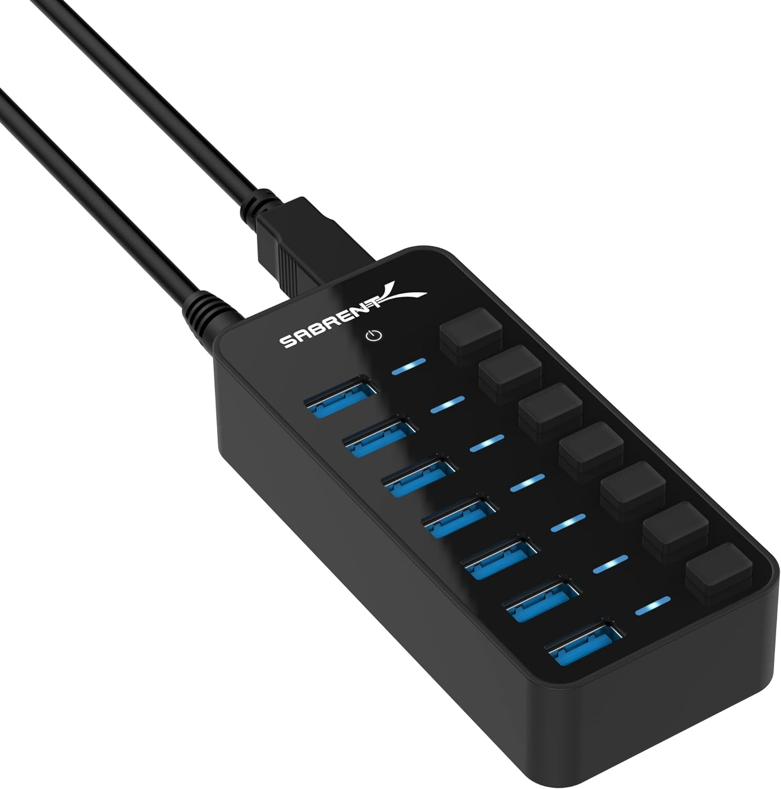
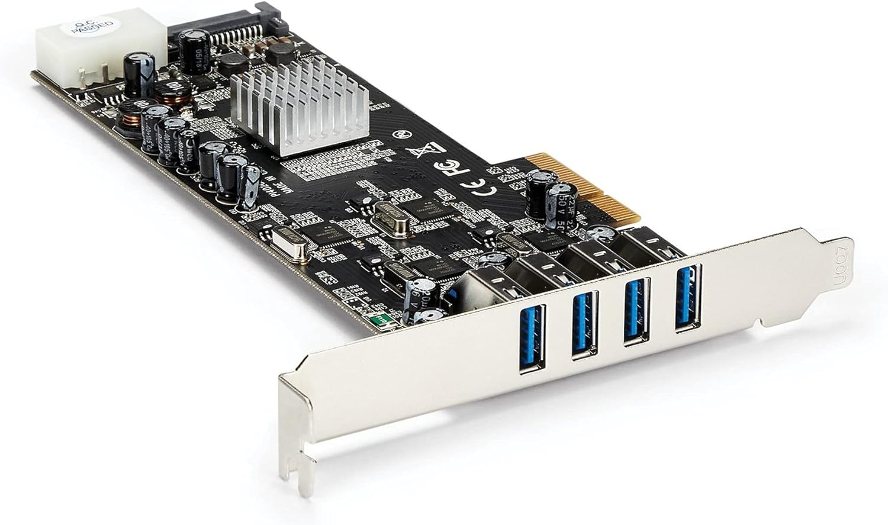
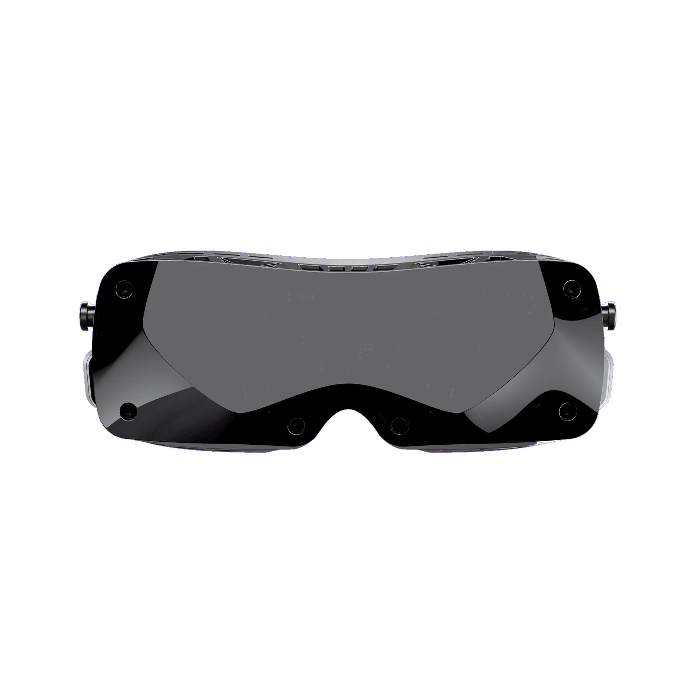
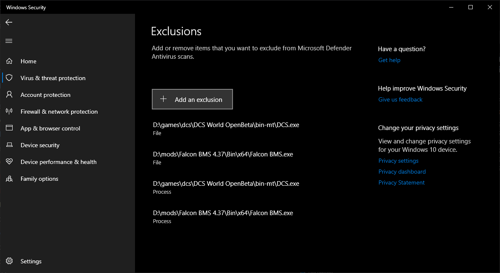
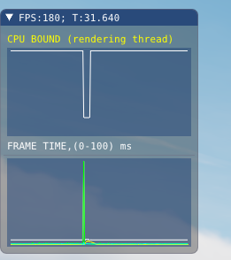
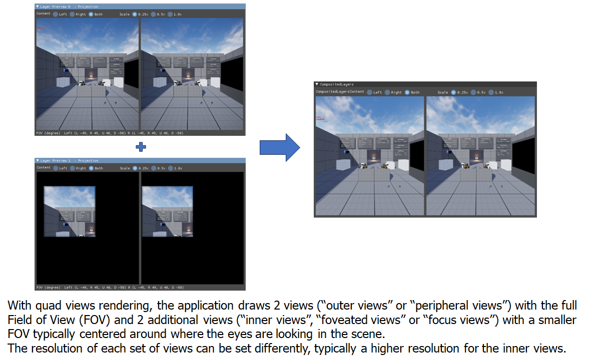

_Photo by Generic (@generic_dcs)_

_This page contains contributions from my friend Lynx._

# Technical Bulletins

_Current known issues and workarounds_

- ⚠️ Intel 13th and 14th generation CPUs have a high rate of failure ([1](https://community.intel.com/t5/Processors/July-2024-Update-on-Instability-Reports-on-Intel-Core-13th-and/m-p/1617113), [2](https://community.intel.com/t5/Blogs/Tech-Innovation/Client/Intel-Core-13th-and-14th-Gen-Desktop-Instability-Root-Cause/post/1633239)) manifesting as strange errors in many games including "out of VRAM" errors and inexplicable CPU crashes. The issue impacts the higher end models at the highest rates, but can impact several SKUs including i9 and i7 models.
  - Fix: Intel has released a pair of microcode patches, one in mid August 2024 and one in late September 2024. Check with your motherboard manufacturer for a BIOS update. However, if the damage has already occurred, there is no fix; the CPU must be exchanged for a new one.

# Recommended Specs

## Storage

You **MUST** install DCS on an SSD (solid state) instead of an HDD (spinning disk). The base game is 160GB and a large install is 700GB+. A dedicated 1TB or larger high performance SSD is recommended.

[Tom's Hardware: Best SSDs](https://www.tomshardware.com/reviews/best-ssds,3891.html)

An SSD is **absolutely essential**. When installed on a spinning disk, DCS can take over 20 minutes to load into a mission and may crash during loading or during gameplay.

> ⚠️ [SK Hynix SSDs have an issue where write performance drops in half after several months of use, requiring the drive to be erased to reset](https://forums.anandtech.com/threads/sk-hynix-platinum-p41-2tb-ssd-write-speed-dropped-by-half.2610542/). This is not a problem for a drive dedicated to DCS only, since write speed is only a factor during updates, and even then only if you have a very fast internet connection. However, we recommend against using SK Hynix SSDs as general purpose drives.

## CPU

The best CPUs for DCS World are AMD X3D series CPUs such as:

- AMD 9800X3D
- AMD 7800X3D
- AMD 7600X3D
- AMD 5800X3D
- AMD 5700X3D
- AMD 5600X3D

However, any fast gaming-oriented CPU with at least 4 cores is fine.

[Gamer's Nexus: Best CPUs of 2023](https://gamersnexus.net/cpus/best-cpus-2023-intel-vs-amd-gaming-video-editing-budget-biggest-disappointment)

Ideally, use an upgraded CPU cooler.

[Gamers Nexus: CPU Cooler Benchmarks](https://gamersnexus.net/megacharts/cpu-coolers)

## RAM

DCS World requires 16GB+ RAM minimum. 32GB-128GB RAM is recommended for large multiplayer servers and the Syria map.

You should ideally use two sticks of RAM and not four sticks. Most systems have lower performance with four sticks due to motherboard and CPU bandwidth limits. If you use overclocked RAM, you are more likely to have stability issues with 4 sticks than with 2.

When purchasing RAM, match the frequency and timings of the RAM to the CPU manufacturer's recommendation. The recommendation may vary by specifc CPU and motherboard. AMD provides a table of their test results with overclocked memory [here](https://www.amd.com/en/products/processors/ryzen-compatible-memory.html). On Intel systems, you are generally limited by the motherboard. Check with the manufacturer of the RAM, as some provide tables on their websites for selecting an appropriate kit.

_In most cases_ the optimal speeds are:

|CPU Type|Speed|Note|
|-|-|-|
|Intel (DDR4)|3200-4000MHz|Diminishing returns past 3200-3600MHz|
|Intel (DDR5)|6400-7200MHz|Varies by motherboard|
|AMD (DDR4)|3600MHz||
|AMD (DDR5)|6000MHz||

For new builds, I strongly recommend 32GB of RAM as a bare minimum.

## GPU

The best GPUs for DCS World are high-end Nvidia and AMD GPUs. Intel GPUs are acceptable for 1080p at lower settings.

Since DCS uses an older graphics engine, high amounts of VRAM is more important than ray tracing performance. 12-16GB+ of VRAM is ideal.

Ideal GPUs for VR include:

Tier | Nvidia | AMD
-|-|-
S+|RTX 4090
S|RTX 4080 Super, RTX 4080, RTX 3090 Ti | 7900 XTX, 7900 XT
A|RTX 4070 Ti Super, RTX 4070 Ti, RTX 3090 | 7900 GRE, 7800 XT, 6950 XT, 6900 XT
B|RTX 4070 Super, RTX 4070, RTX 3080 Ti, RTX 3080 12GB | 6800 XT

[Gamers Nexus: Best & Worst GPUs of 2023](https://gamersnexus.net/gpus/best-worst-gpus-2023-gaming-100-2000-video-cards)

[Tom's Hardware: GPU Hierarchy](https://www.tomshardware.com/reviews/gpu-hierarchy,4388.html)

## PSU

You should have a sufficient power supply for your CPU and GPU. 

**PSU wattage alone is not a good indicator of reliability under load. 80PLUS ratings are not useful** for determining overall power delivery and efficiency across a range of scenarios. The 80PLUS rating only test efficiency at a few specific loads, and does not test for performance or reliability. Manufacturers can and do game these ratings! 

You need to select a PSU based on results from bench testing by knowledgeable people with the appropriate equipment. Check any power supply you plan to purchase against the [Cultist Tier List](https://cultists.network/140/psu-tier-list/) (see [spreadsheet](https://docs.google.com/spreadsheets/d/1eL0893Ramlwk6E3s3uSvH1_juom7SMG5SCNzP2Uov8w/edit?gid=1719706335#gid=1719706335) for newer data not yet on the website), as well as  [LTT Labs' PSU testing](https://www.lttlabs.com/categories/power-supplies) testing. Only buy if it is Tier B on the Cultist list and/or recommended by LTT Labs.

## USB



Some USB devices such as HOTASes may exhibit jitter or other issues when connected directly to a computer’s USB power. This is especially a problem with the Saitek/Logitech X52, X55 and X56. In many cases, this can be resolved using a powered USB hub. I’ve personally found powered USB hubs from SABRENT to be good quality for the price. Some of these hubs also have individual switches for each port, which is handy for quickly disconnecting your flight sim devices to play other games where those devices cause problems (looking at you, *Elden Ring*).



Your motherboard has a limited number of USB devices and limited amount of USB bandwidth it can support. Each USB controller chip can support 127 USB devices- but note that a single physical device often consumes multiple virtual device slots!

Flight simulator devices can push past these device and bandwidth limits, especially when using some of the more advanced head trackers/webcams, VR headsets, and USB displays. If you notice these devices having issues, you may need additional USB controller chips.

Some motherboards have a separate USB controller for the front and rear I/O, which may extend this limit. Other motherboards may have multiple controllers for the rear I/O. Consult your motherboard manual to determine which physical ports correspond to which controllers.

You can add a USB PCIe expansion card to your system and move some devices to the expansion card. We have tested a few of the cheaper and lower end PCIe cards and found them lacking. The very cheapest cards do not actually contain a dedicated controller chip and are simply internal hubs. With other cheap cards we encountered issues such as:

- Cards failing after a few weeks of driving a VR headset
- Driver incompatibilies
- System stability issues such as BSOD crashes and boot loops

In the worst case, a malfunctioning USB card can damage your motherboard through the PCIe port.

The only reliable brand we've found is [StarTech](https://www.startech.com). While they are expensive, they are the gold standard for commercial systems. We particularly recommend this [4 port card](https://www.amazon.com/StarTech-com-Express-SuperSpeed-Dedicated-Channels/dp/B00HJZEA2S), which has 5Gbps of bandwidth _per port_ rather than sharing a single channel across all ports. You can then attach a hub to each of the ports to share the bandwidth across physical devices as required.

# Head Tracking

A head tracker is ideal for anyone who is not using VR. See [the companion article on head trackers.](../headtracker/)

# Virtual Reality

> ⚠️ Don’t bother with DCS VR unless:
> 1. You have a very high end PC
> 2. You are willing and able to troubleshoot all manner of obscure technical issues
> 3. You are comfortable installing software from GitHub and very carefully reading technical instructions written by software engineers
> 4. You have a head tracker to fall back on when updates break VR support from time to time

There are no perfect VR headsets, but there are a few worth consideration for DCS. Based on our testing, we currently recommend the **Pimax Crystal Light** as our primary recommendation and the **Meta Quest 3** as a budget option. 

We also recommend using IEMs for audio instead of the mediocre speakers included with most headsets. For budget IEMs, I like the [7HZ x Crinacle Zero:2](https://www.linsoul.com/products/7hz-x-crinacle-zero-2) and [Moondrop CHU II](https://moondroplab.com/en/products/chu-ii).

## [Pimax Crystal Light](https://pimax.com/pages/crystal-light)

 

**Pros**|
-|
Good field of view (104°x104°)
Excellent display with great pixel density (35 PPD)
Available with or without controllers
Offers both external lighthouse and inside-out tracking options, allowing flexible choice between convenience or tracking fidelity

**Cons**|
-|
Expensive when bundled with controllers or if including the cost of lighthouses
Heavy and bulky, though lighter than the standard Pimax Crytsal
Some users report issues with inside-out tracking
No eye tracking
Mixed experiences with customer support
Medicore microphone and speaker quality

## [Meta Quest 3](https://www.meta.com/quest/quest-3/)


**Pros**|
-|
Decent field of view (110°x96°)
Relatively affordable
Easy to configure for PCVR use
Good warranty with easy returns/exchanges
Also good for roomscale
Standalone capbilities
Includes controllers
**Cons**|
Requires a quality wifi5/wifi6 dedicated router or wireless access point *or* a third party charging+link cable for long sessions
Significantly lower pixel density than our other recommendation (25 PPD)
Significant compression artifacts including image noise and color banding
Forced Oculus/Meta software updates contain breaking changes and sometimes unfixable issues
No eye tracking
Medicore microphone and speaker quality

## [Pimax Crystal](https://pimax.com/crystal/)


**Pros**|
-|
Same Pros as Crystal Light
Excellent eye tracking
**Cons**|
Expensive
Requires a separate battery, even when connected to power source
Heavy and bulky
Similar cons to Crystal Light: Inside-out tracking issues, medicore microphone and speaker quality, mixed customer support experiences

## [Bigscreen Beyond](https://store.bigscreenvr.com/products/bigscreen-beyond)



**Pros**|
-|
Excellent OLED display with good pixel density (32 PPD)
Lightweight with a small form factor
Custom fitted for maximum comfort
High quality customer support
High quality microphone
**Cons**|
Slightly lower field of view (102°x99°)
Requires external lighthouses for tracking
Expensive, especially when including the price of the recommended number of lighthouses
IPD is not user adjustable - cannot share headset with someone who has a different IPD
Each user needs a separate custom fitted gasket cushion
High restocking fee after shipping
No controllers available - roomscale requires controllers from another brand
Not compatible with eyeglasses - users with vision deficiency will need prescription inserts
Due to the combination of panel and lens, some users find the image to have low luminance and high image persitence, similar to the ghosting on an LCD monitor with a VA panel
Glare in high contrast scenes
No eye tracking
No integrated audio

## Why not…?

### Meta Quest 3S

- The Quest 3S is optically identical to the Quest 2, with some additional features such as passthrough and hand tracking, and upgraded onboard hardware.
- Meta uses multiple suppliers for the LCD panel, with significant variance in color and visibly different pixelation. You might get a panel with good color, or one with washed out colors.
- The much better display on the Quest 3 is preferred, but the Quest 3S may be a decent introductory headset if you get it at a good price.
- If you are only interested in PCVR and not standalone VR, consider a used or refurbished Quest 2 instead. It is optically identical to the 3S for PCVR use.

### Meta Quest 2

- Meta used multiple suppliers for the LCD panel, with significant variance in color and visibly different pixelation. You might get a panel with good color, or one with washed out colors.
- The much better display on the Quest 3 is preferred, but a used or refurbished Quest 2 may be a decent introductory headset if you get it at a good price.

### Meta Quest Pro

- The Quest 3 is both cheaper and higher resolution.
- On Meta headsets, eye tracking with OpenXR is only available in debug mode. This requires a developer account, which must be verified by Meta. *The author had to send their driver’s license to Meta to pass verification. Your experience may vary.*
- The eye tracking on the Quest Pro is not as good as the Pimax Crystal when used with PC VR. It lags behind your gaze by a few frames. *The author finds this noticeable but tolerable. Your experience may vary.*
- Some users report eye & face tracking hardware failure due to sweat/moisture.
- The slightly better controllers on the Quest Pro compared to the Quest 3 are of limited use for stationary simulations.
- There are *some* advantages - good comfort, ability to see your HOTAS and keyboard through the gap between the headset and your face, and the included controllers are great for roomscale games. But the advantages aren’t worth the tradeoffs for most people, given this price point.
- Awkward middle child between the Meta Quest 3 and Pimax Crystal.

### HTC Vive Focus Vision

- The lenses in the Focus Vision are very poor in quality, resulting in a mostly blurry image.
- General problems with tracking, video stability and eye tracking.
- Probably the worst value headset on the market as of this writing.

### HP Reverb G2

- Microsoft has removed Windows Mixed Reality from Windows, and the G2 relied on WMR to function. (Existing installations continue to work if Windows updates are deferred, but this will become increasingly impractical over time.)
- There is some hope that [Monado](https://monado.freedesktop.org/) will provide support in the future, but this is not guaranteed.
- Very common hardware failures due to internal damage to the proprietary video cable.

### Valve Index

- The Index is severely outdated hardware, overpriced and underperforming compared to the Meta Quest 3 and other current options.

### Apple Vision Pro

- Not officially compatible with OpenXR, which is required for DCS/BMS.
- A workaround is available using ALVR streaming, but it has no guarantees of continuing to work.
- Extremely high price!

# Windows Settings and Tweaks

## General Tweaks

If you are running an Intel [Alder Lake](https://en.wikipedia.org/wiki/Alder_Lake) CPU or AMD [Ryzen 7000](https://en.wikipedia.org/wiki/List_of_AMD_Ryzen_processors#Ryzen_7000_series) Series CPU or newer, upgrade to Windows 11 to use the new Thread Director. Alternatively, you may be able to disable your efficiency cores (E-Cores) in your motherboard settings, but this may impact performance and power consumption in other applications.

Install any available Windows updates.

If your system supports [Resizable BAR](https://www.intel.com/content/www/us/en/support/articles/000090831/graphics.html) and/or [Smart Access Memory](https://www.amd.com/en/technologies/smart-access-memory), enable it.

Close any unnecessary programs and browser tabs when playing DCS.

Uninstall all bloatware packaged by the manufacturer of your computer.

Disable any VPN software when playing DCS multiplayer.

Third party antivirus such as Kaspersky, BitDefender, McAfee, Norton, MalwareBytes, etc. is not recommended. These cause problems with DCS in particular because they flag the Digital Rights Management (DRM) encryption of the game files as a possible threat and quarantine or delete game files randomly. Third party antivirus also tends to cause general performance issues. We recommend using the default Microsoft Defender antivirus, and [optionally adding an exception for DCS.](#exclude-dcs-from-microsoft-defender-antivirus)

## Intel CPU Tweaks

Be sure to enable [XMP](https://www.intel.com/content/www/us/en/support/articles/000095207/intel-nuc.html#:~:text=XMP%20or%20Extreme%20Memory%20Profiles,higher%20than%20standard%20memory%20speeds.) in your motherboard settings as it's often disabled by default.

## AMD CPU Tweaks

If you have the 7900X3D/7950X3D, or a Ryzen X3D CPU with *dual* CCDs, install the [Xbox Game Bar](https://apps.microsoft.com/store/detail/xbox-game-bar/9NZKPSTSNW4P) and run it while playing games. AMD’s software uses it to detect when a game is running and change CPU scheduling behavior to allow maximum performance.

Be sure to enable [DOCP/EXPO](https://www.corsair.com/ca/en/explorer/diy-builder/memory/amd-expo-vs-docp/#:~:text=Called%20EXPO%2C%20which%20is%20short,available%20on%20the%20DDR5%20standard.) in your motherboard settings as it's often disabled by default. *I measured a 13% CPU performance gain in 3DMark toggling it on and off on my AMD system.*

Adjusting [Precision Boost Overdrive 2](https://www.amd.com/en/resources/support-articles/faqs/CPU-PB2.html) (PBO2) optimizes power consumption and thermals. Depending on your CPU cooling setup, this may also slightly improve performance.





## Nvidia GPU Tweaks

Update your graphics drivers to the latest available version from [nvidia.com/drivers](https://nvidia.com/drivers) or through [GeForce Experience](https://www.nvidia.com/en-us/geforce/geforce-experience/). If you are running an outdated driver version, some options like DLSS and SSS may be grayed out in the in-game options.

Disable Hardware Accelerated GPU Scheduling in Windows settings. It increases input latency and stutter, especially on mid to high end systems when using VR.

Disable [ShadowPlay](https://www.nvidia.com/en-us/geforce/geforce-experience/shadowplay/) if you aren't using it to record gameplay footage.

## AMD GPU Tweaks

In the AMD Software, navigate to Preferences, and next to AMD User Experience Program, click Learn More and then Leave. If left enabled, this setting runs a telemetry service on your computer. *I found this service was consuming a lot of system resources and making my system generally sluggish on boot. Leaving the program made my computer substantially snappier and my applications started much faster.*

## Exclude DCS from Microsoft Defender Antivirus

Real-time antivirus scans can reduce performance for programs that need to read many files from disk during runtime. You can disable real-time scans of files that DCS accesses while DCS is open. The files will still be scanned by regular scheduled scans when DCS is not running.

> ⚠️ If you use mods or play multiplayer, this tweak increases your risk. Use your best judgement about whether to use this tweak. I personally wouldn’t use this with any mod for which I haven’t read the source code. If you use the [3D Editor for DCS Web Editor](https://dcs-web-editor.github.io/dcs-web-editor-docs/editor/3deditor/), this also increases your vulnerability to malicious scripts in mission files.

For the default Microsoft Defender antivirus:

1. Open the Windows Security application
2. Select Virus & Threat Protection in the sidebar
3. Under Virus & Threat Protection settings, click Manage Settings
4. Under Exclusions, click Add or Remove Exclusions
5. Add a File Exclusion for **the full path** to `DCS.exe`, e.g. on my system it is `D:\games\dcs\DCS World\bin\DCS.exe`
6. Add a Process Exclusion for **the full path** to `DCS.exe`, e.g. on my system it is `D:\games\dcs\DCS World\bin\DCS.exe`

Here is what mine looked like after this. Yours will look differently.



## Set Page File Size

The [page file](https://learn.microsoft.com/en-us/troubleshoot/windows-client/performance/introduction-to-the-page-file) is used by Windows for infrequently accessed data that would otherwise consume RAM. **For most users, the default setting is fine.** However, some users have found that manually setting the page file size improves performance. This is especially useful if your PC contains multiple types of storage with different speeds, such as both SSDs and HDDs. It’s also useful if you don’t have a lot of free space on your page file’s drive, to help Windows plan better with the limited space.



> 💡 Reboot your PC after changing page file settings.

## Disable USB Selective Suspend

[USB selective suspend](https://learn.microsoft.com/en-us/windows-hardware/drivers/usbcon/usb-selective-suspend) is a feature intended to reduce electricity usage by powering down idle devices. This can cause problems for flight simulators, such as disconnecting your peripherals during a long cruise, or in some cases, causing devices like head trackers to stop working after a few minutes of use. 

Disable this setting:

1. Press the `⊞ Win` key to open the start menu, and type “edit power plan”. Click the result that leads to the Control Panel.
2. In the Edit Plan Settings page that appears, click “Change advanced power settings”
3. In the Power Options window that appears, navigate to “USB selective suspend setting” and choose “Disabled” from the dropdown


# Game Tweaks

## Enable the Frame Rate Counter

While playing the game, press `RCtrl + Pause` to open a frame rate counter widget. You can use this to check your current framerate and whether you are currently CPU bound or GPU bound. You can use this to measure the performance impact of settings and tweaks.



> 💡 There is a 180FPS limit by default.

> 💡 The CPU BOUND/GPU BOUND indicator is not accurate in all cases. To find out if you are CPU limited you must compare frame render time to framerate to determine if your GPU is rendering frames faster than the framerate.

> 💡 Frame times will be inaccurate in VR if Turbo Mode is enabled in OpenXR Toolkit/Quad Views.

## Recompile Shaders

Every time that DCS World is updated, your graphics driver is updated, or you change your graphics card, you should delete the following directories in your [Saved Games folder](#saved-games-folder):

`<Saved Games folder>\fxo`

`<Saved Games folder>\metashaders2`

These folders contain [shaders](https://en.wikipedia.org/wiki/Shader), which need to be rebuilt whenever either the game or graphics card driver is updated. DCS does not seem to consistently automatically rebuild these, resulting in performance issues. Deleting the folders will force DCS to rebuild them; this may cause a one-time increase in load times or some stutter during gameplay, but these will only happen once for each shader and the game may run smoother afterwards.

Learn more about shader compilation:



## Disable Data Exports

If you use data exports such as TacView, Winwing’s SimAppPro, DCS-BIOS etc. You should disable these when playing large missions. These export a large amount of data from DCS on every frame, contributing to slowdown.

One way to disable data exports is to edit the `Export.lua` script within your [Saved Games folder](#saved-games-folder). Open `<Saved Games folder>\Scripts\Export.lua` in a text editor. Add two hyphens (`--`) in front of a line to disable that line. For example, my `Export.lua` contains lines for TacView, DCS-BIOS and SRS:

```lua
local Tacviewlfs=require('lfs');dofile(Tacviewlfs.writedir()..'Scripts/TacviewGameExport.lua')
dofile(lfs.writedir()..[[Scripts\DCS-BIOS\BIOS.lua]])

pcall(function() local dcsSr=require('lfs');dofile(dcsSr.writedir()..[[Mods\Services\DCS-SRS\Scripts\DCS-SimpleRadioStandalone.lua]]); end,nil)
```

I can disable TacView and DCS-BIOS as such:

```lua
--local Tacviewlfs=require('lfs');dofile(Tacviewlfs.writedir()..'Scripts/TacviewGameExport.lua')
--dofile(lfs.writedir()..[[Scripts\DCS-BIOS\BIOS.lua]])

pcall(function() local dcsSr=require('lfs');dofile(dcsSr.writedir()..[[Mods\Services\DCS-SRS\Scripts\DCS-SimpleRadioStandalone.lua]]); end,nil)
```

To reverse this change, remove the hyphens you added.

## Reduce Disk Usage

Certain SSDs have reduced write performance when close to full because the size of dynamic SLC cache decreases on a full drive. Depending on the model of SSD, you should keep free space at around 25%. This number may change depending on if the SSD is overprovisioned or has DRAM cache.

### Periodically Delete Tracks

Every so often, delete Track files from your [Saved Games folder](#saved-games-folder) to free up disk space. You can find `.trk` files in `<Saved Games folder>Tracks\Multiplayer`.

If you use Tacview, also delete old `.acmi` files in `%userprofile%\Documents\Tacview`.

### Compress Game Files

This tweak doesn’t improve in-game performance, but can save disk space and doesn’t hurt performance. Download [Compactor](https://github.com/Freaky/Compactor) and use it to compress the DCS World game directory and the [Saved Games folder](#saved-games-folder). The compression algorithm it uses is built into Windows and has virtually zero performance impact on CPUs made after 2010. On my computer, this shrunk DCS World’s disk usage by over 110GB with no in-game performance impact.


## Shrink Kneeboard Pages

Very large kneeboard pages can cause a performance impact. Use image editing software to scale your kneeboard pages down to the resolution of your display. [OpenKneeboard’s guide to sizing](https://openkneeboard.com/faq/#how-do-i-get-the-best-visual-quality-or-the-most-readable-text) has useful tips for both VR and 2D.

# VR Tweaks

If you use a Virtual Reality headset, there are some additional tweaks and considerations.

## Drivers

In most cases, you should install the latest drivers for your GPU. In some cases a new driver may have a performance issue for VR and you may need to install an older version.

## Prefer Standalone Over Steam

Launching DCS through SteamVR runs the game use the older OpenVR API rather than directly using the OpenXR API. This causes a significant performance hit (though the exact amount may vary by system).



For the best performance, run the Standalone version of DCS directly with VR mode enabled in DCS settings.

If you must use Steam, launch the game normally through the desktop client with VR enabled in DCS settings, rather than through SteamVR.

To convert an existing Steam installation to Standalone:

1. [Download and run the standalone installer](https://www.digitalcombatsimulator.com/en/downloads/world/)
2. Untick "download" at the end of the setup wizard
3. Manually copy or move your files from the Steam installation to the Standalone installation
4. Delete `<DCS standalone installation folder>\Config\retail.cfg`
5. Run the “Repair DCS World” application in your Start Menu

## Quad Views Rendering

[Quad Views Rendering](https://github.com/mbucchia/Quad-Views-Foveated/wiki/What-is-Quad-Views-rendering%3F) is a technique that renders the focus area within your headset at a higher resolution than the rest of the headset. If your headset has eye-tracking, the high-resolution render area will follow your gaze; otherwise, it will be centered within your headset.



This can hugely reduce the number of pixels needed to render, improving performance. However, in a combat flight simulator it can also cause problems tracking small, fast moving objects outside of the focus area, such as a dogfight opponent, tracer fire, or the lights on the carrier during a night trap. It may require some tuning and user preference. Results may vary depending on the specific headset and the user’s vision and preferences. If your system is CPU bottlenecked, this might decrease your performance overall.

To try this, use both [Quad Views Foveated](https://github.com/mbucchia/Quad-Views-Foveated) and [Quad Views Companion](https://github.com/TallyMouse/QuadViewsCompanion). The former implements the feature, and the latter provides a GUI for changing the settings in `%localappdata%\Quad-Views-Foveated\settings.cfg`.

Ensure that the following options are enabled in DCS's VR settings as well. **These checkboxes only appear if Quad Views Rendering is installed and DCS is launched with VR enabled.**

- Use Quad Views
- Track the eyes position (if your headset supports eye tracking)

Note that if you choose to use both Quad Views Rendering and OpenXR Toolkit together, you should set settings like Turbo Mode and foveated rendering/render scale in QuadViewsCompanion and leave them at the default setting in OpenXR Toolkit.

RedKite has a good video demoing eye-tracked Foveated Rendering:



*Note: If you are using a Meta Quest Pro, you’ll need to install [OpenXR Eye Trackers](https://github.com/mbucchia/OpenXR-Eye-Trackers/wiki/Meta-Quest-Pro) to enable eye tracking on PC. You will probably need a verified Developer account.*

## Meta Quest Link Cable

If you have a Meta Quest headset, a link cable will provide the best video quality. Meta sells an [official link cable](https://www.meta.com/quest/accessories/link-cable/) if you don’t have one, and more affordable third-party cables are also available.

A tradeoff is that you may not be able to charge your headset and use the link cable at the same time, which may limit how long you can fly at a time. [This third party cable](https://a.co/d/765REiP) allows connecting both a charger and link at once, which extends battery life sufficiently for very long flights.

## Virtual Desktop

[Virtual Desktop](https://www.vrdesktop.net/) is a third-party VR streaming application. Although its primary use case is for displaying 2D content in VR, it also provides advanced options for improved stream quality for VR content. In my testing with Meta Quest devices, I was able to see a higher level of clarity using Virtual Desktop compared to  Meta Quest Link. Your experience may vary depending on your hardware, especially your network bandwidth and wireless access points.

## DLSS/FSR

DLSS as implemented in DCS doesn’t work great in VR headsets, causing noticeable ghosting. [It is possible to override the DLSS implementation to one that doesn't cause ghosting using an unofficial tweak.](https://forum.dcs.world/topic/356743-update-the-dlss-preset-used-by-dcs-to-remove-ghosting/)

FSR also causes visual artifacts, such as ghosting/blurring on moving options and when switching MFD pages.Your mileage may vary based on your headset and vision.

## XRNeckSafer

If you find it uncomfortable or painful to twist your torso and neck to look behind you/over your wing, you can use [XRNeckSafer](https://gitlab.com/NobiWan/xrnecksafer) to provide an assist.

## Separate Profiles for 2D and VR

If you play in both 2D and VR, you can set up some tweaks to make switching between them easier.

Create two separate shortcuts for DCS, one for 2D and one for VR. For 2D:

`"D:\games\dcs\DCS World\bin\DCS.exe" --force_disable_VR`

For VR:

`"D:\games\dcs\DCS World\bin\DCS.exe" --force_enable_VR`

Additionally, you can save custom graphical settings into three different slots in the Options > System tab, using the presets buttons in the bottom right. You can use one for your 2D settings and another for your VR settings.

You can then manually switch between these presets, or use [SkateZilla’s launcher](https://forum.dcs.world/topic/134493-the-dcs-updater-launcher-gui-utility-version-20-2023/) to automatically launch using one or the other.

## Asynchronous Space Warp on Meta/Oculus headsets

[Asynchronous Space Warp](https://developer.oculus.com/blog/asynchronous-spacewarp/) (ASW) is a technology that improves perceived smoothness in VR, at the tradeoff of locking the framerate to an integer divisor of the headset’s refresh rate. This feature is great if you can maintain your headset’s refresh rate. However, if your framerate dips below the refresh rate even slightly, it will immediately drop to 1/2 the refresh rate. It can also cause judder when using helmet-mounted displays.

On Meta Quest headsets using Link/AirLink, you can toggle ASW while playing with these keys:

| Keybind | ASW | Framerate |
| --- | --- | --- |
| Ctrl+Num1 | Disabled | Unlocked |
| Ctrl+Num2 | Disabled | Locked |
| Ctrl+Num3 | Enabled | Locked |
| Ctrl+Num4 | Auto | Unlocked |

> ℹ️ My personal preference is ASW disabled and framerate unlocked (Ctrl+Num1)

## Lower Refresh Rate

You should lock your headset to the _lowest_ refresh rate that you can use comfortably. This helps reduce the visual impact of stuttering. I personally find a refresh rate of 72Hz to work best for me, but if you are impacted by VR sickness or motion sickness, you may need a higher setting such as 90Hz.

## OpenXR Toolkit

[OpenXR Toolkit](https://mbucchia.github.io/OpenXR-Toolkit/) provides tweaks for VR applications. This used to be an important tool, but improvements in OpenXR, DCS World and Quad Views Rendering mean it's mostly an optional tool for those who want to configure advanced tweaks. Some notable settings:

- Turbo Mode, which makes VR feel smoother by forcing frames to render more quickly rather than wait for consistent frame timing. Note that this seems to cause weird, unexplained problems when combined with SteamVR.
- The supersampling in OpenXR toolkit works better than the supersampling built into DCS.

After it’s installed, you can open the toolkit menu while playing and tweak settings. See [the usage instructions](https://mbucchia.github.io/OpenXR-Toolkit/#basic-usage) and [feature list](https://mbucchia.github.io/OpenXR-Toolkit/features.html) for more info.

# Suggested Game Settings

These settings are a good starting baseline; you may need to tweak and test further, especially for VR setups.

## Audio

| | |
|-|-|
| Music | 0% (Only effects main menu, not in-game scripted music) |
| Hear like in Helmet | Enabled |

## System

| | |
|-|-|
| Res of Cockpit Displays | 1024 Every Frame |
| Anti-Aliasing | Off or MSAA 2x/MSAA 4x. Do not use TAA - it causes ghosting. Do not use DLAA - it causes blurring. MSAA may reduce shimmer in VR |
| Upscaling | Off has best fidelity (no blurring/ghosting), especially on 1080p monitors. Try DLSS Quality and sharpening 0.5 on newer Nvidia graphics. Try FSR with scaling 0.9 and sharpening 0.8 on AMD graphics or older Nvidia graphics. Tune sharpening to user preference. If this is grayed out, turn off anti-aliasing and verify drivers are fully updated |
| Textures | High |
| Terrain textures | High |
| Heat Blur | High (2D) or Off (VR). In VR, the blur renders incorrectly, causing it to blur objects in front of the heat. |
| Shadows | Off or High |
| Flat Shadows Blur | Off |
| Secondary Shadows | User preference. Particularly impactful on carriers and at large airbases |
| SSS (Screen Space Shadows) | User preference |
| Visib Range | Medium or High |
| Civ Traffic | Off |
| Clouds | High or Ultra |
| Depth of Field | Off. Causes artifacting in VR when using Quad Views Rendering |
| Water | Medium |
| SSAO | Off. Causes artifacting in VR when using Quad Views Rendering |
| SSLR | Off. Causes artifacting in VR when using Quad Views Rendering |
| Lens Effects | Off. Causes artifacting in VR when using Quad Views Rendering |
| Motion Blur | Off. Causes artifacting in both 2D and VR |
| Clutter/Grass | 0 |
| Forest Visibility | 100% |
| Forest Details Factor | 1 |
| Scenery Details factor | 1 |
| Preload Radius | Start at 2000 for every GB of RAM in your system. If the game runs fine, double it and test again. Tune upwards if you experience moderate stutter when flying. Tune downwards if you have excessive RAM usage or periods of freezing/heavy stutter. |
| Chimney Smoke Density | 0 |
| LOD Switch Factor | No lower than 1.0. Increase on higher end systems to reduce “pop-in” of low detail models. Particularly noticeable on larger objects like ships, less noticeable on smaller objects like cars. |
| Anisotropic Filtering | 16x |
| Terrain Objects Shadows | Flat or Default (Default matches Shadows setting) |
| Cockpit Global Illumination | On |
| Rain droplets | Enabled |

## Gameplay

| | |
|-|-|
| Game Flight Mode | Disabled (Breaks the entire game!) |
| Easy Communication | Disabled (Breaks missions) |
| G-Effects | None (User preference, but the effect is probably too aggressive while AI are not effected at all) |
| Birds | 0 (Causes random engine failures at low altitudes) |

## Misc

| | |
|-|-|
| Force Feedback | Disabled (unless you have Force Feedback hardware) |
| Random System Failures | Disabled |

## VR

| | |
|-|-|
| Pixel Density | 1.0 (If you want to enable supersampling, configure it in your headset’s software or Quad Views instead.) |
| Force IPD Distance | Off (This configures world scale, which should be set in OpenXR Toolkit instead: https://mbucchia.github.io/OpenXR-Toolkit/other-features.html#world-scale-override) |
| Bloom effect | Off (causes artifacting when using foveated rendering) |
| Enable HMD Mask | On unless you are livestreaming or recording |
| MSAA Mask Size | If set to a value below 1.0, MSAA will only be applied to the center of the display. Some users report that setting this to values other than 1.0 caused issues. |
| VR Mirror Use DCS System Resolution | On. Turning this off decreases performance and interferes with Jester features in Heatblur modules. Use external software such as Oculus Mirror Utility for recording/livestreaming. |
| Use Quad View | On, if you have installed and configured Quad Views Rendering |
| Track the eye position | On, if you have installed and configured Quad Views Rendering and your headset has an eye tracker |

# Troubleshooting Crashes

## Logs

There is a log file located in the [Saved Games folder](#saved-games-folder) at `<Saved Games folder>\Logs\dcs.log`. It can sometimes provide clues for why DCS has crashed, but can be difficult to interpret.

## Sanity checks

These are some basic steps that have been known to fix crashes for some users in the past.

### Recompile Shaders

Follow the steps in the Recompile Shaders section above to clear the shader cache.

### Remove all mods

Mods in DCS can cause bizarre, seemingly unrelated issues. Reflected of Reflected Simulations has documented some of the utterly strange bugs that can be caused simply by having a mod installed.



As a troubleshooting step, remove all mods from your DCS installation. (Kneeboard pages are OK. Sound mods, modded aircraft and other assets should be removed. In some rare cases even liveries have caused crashes, such as if a module's 3D model or textures were updated and an old livery was installed.)

### Repair DCS

Follow the instructions on [how to cleanup and repair DCS](https://www.digitalcombatsimulator.com/en/support/faq/repair/). This will reset your game folder to default.

### Rename Saved Games Folder

Occasionally, something in the [Saved Games folder](#saved-games-folder) triggers problems in DCS. *I personally had this problem with F-15E Strike Eagle crashing when it came out, and this fixed the issue for me.*

Rename the Saved Games folder to `%userprofile%/Saved Games/DCS.backup`, then launch DCS. It will reset all of your settings including graphics settings, controls, player profiles, etc. to default. If this fixes your crash, you can then copy the files from the backup back into the Saved Games folder a piece at a time (or reconfigure the game from scratch).

## Stability Testing

A potential cause of random crashes is hardware stability issues. The two most common problems we've seen are:

1. Power supply not appropriate for the system. **Wattage and 80PLUS ratings do not tell you if a power supply is reliable or correct for your system**. Modern high-end graphics card are sensitive to voltage stability, and many power supplies - even expensive, high wattage ones from major brands - do not supply stable power under load, resulting in random crashes.
1. Unstable configuration of RAM. All of the following are risk factors for RAM instability:
  - Using four sticks instead of two
  - Enabling an overclocking profile EXPO/XMP/DOCP/EOCP
  - AMD CPUs are generally more sensitive to RAM problems than Intel CPUs
  - Having a large amount of RAM, especially over 32GB

You can detect these stability problems by running stress tests on your hardware.

Use [OCCT](https://www.ocbase.com/) to test your system under high graphics load.

Use [Memtest86+](https://www.memtest.org/) to test your system's memory overnight.

# Saved Games Folder

Some steps above reference the “Saved Games folder”, which is located in the following places:

- If you play on Steam, it is `%userprofile%\Saved Games\DCS`
- If you play on Standalone version, it is `%userprofile%\Saved Games\DCS`...
    - …unless you upgraded from an Open Beta version prior to patch [2.9.3.51704](https://www.digitalcombatsimulator.com/en/news/changelog/stable/2.9.3.51704/), in which case it is `%userprofile%\Saved Games\DCS.Openbeta`, even after the Open Beta and Stable versions were unified.
