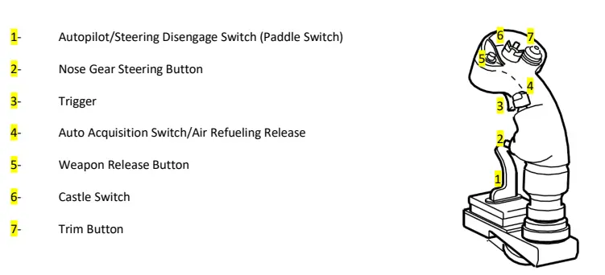

Open the Falcon BMS Alternative Launcher (`Launcher\FalconBMS_Alternative_Launcher.exe`).

# Assign Axes

Click AXISASSIGN and map the following Axes:

- Roll
- Pitch
- Throttle
- Yaw

If you have rudder pedals:

- Toe Brake
- Toe Brake Right

If you have a HOTAS with a cursor slew and/or rotary axes

- Cursor X
- Cursor Y
- Antenna Elevation
- Range Knob

# Assign Buttons

Click KEYMAPPING.

Set the Profile dropdown to F-15.

## Assign Control Stick

Set the Category dropdown to CENTER CONSOLE. Scroll down and find the section for CONTROL STICK.

Map the controls in the diagram to your stick as you see fit.  Reference `Docs\02 Aircraft Manuals & Checklists\TO 1F-15C-1 BMS.pdf`, section 4.1.2.2.49 for a description of functions.

All controls on the stick are important.

## Assign Throttle

Set the category dropdown to LEFT CONSOLE. Scroll down and find the section for THROTTLE.

Assign the controls as you see fit. Reference `Docs\02 Aircraft Manuals & Checklists\TO 1F-15C-1 BMS.pdf`, section 4.1.2.1.16 for a description of functions.

The finger lift switches are only used during startup and may be best bound to your keyboard, depending on what type of throttle you have.

The SBR switch has no function in BMS 4.37.

## Assign Other Controls

Assign any other controls as you see fit. Reference `Docs\02 Aircraft Manuals & Checklists\TO 1F-15C-1 BMS.pdf`, Section 4 for a description of cockpit layout and switch functions.

You’ll probably need `GEAR: LG Handle`, `ACAS` (autopilot). You might find `RADAR` convenient to bind to a button box or keyboard. Flaps in the F-15 are automatic, so no need to bind them somewhere convenient.

# Next Steps

[Create a quick campaign and test your controls](../../campaign/).

[Begin to study the manuals and other learning materials](../../learning/).
