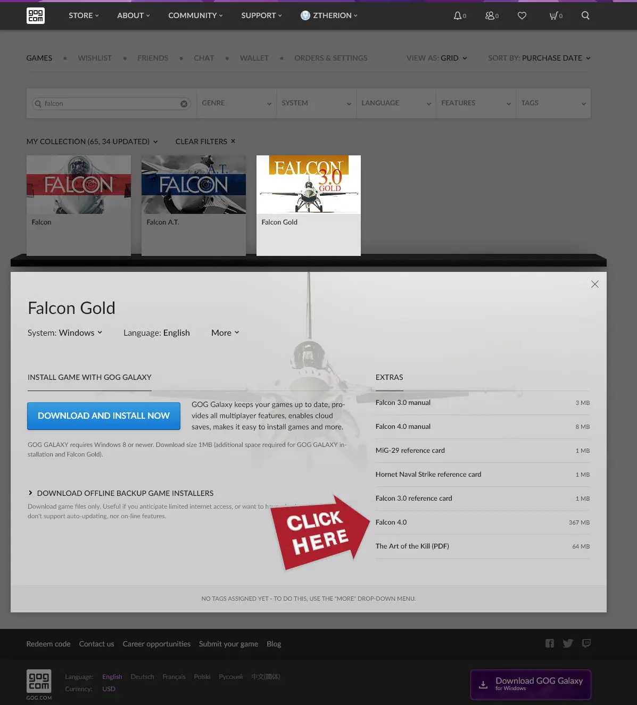

# Things You Need

A Windows computer. Pretty much any modern gaming PC with a fast CPU will work; BMS is not a terribly demanding game.

A HOTAS. This guide assumes you have a quality HOTAS with plenty of buttons, not just a simple flight stick.

<aside>
🎮 Gamepads don’t work well for throttle control in BMS, and the BMS developers have spoken out against supporting gamepads. A joystick or HOTAS are therefore recommended for BMS.

</aside>

[HOTAS Buyers Guide for Combat Flight simulation](../../hotas/)

Some type of [head tracker](../../headtracker/) so you don’t have to use the mouse to look around. Alternatively, BMS has VR support. See my DCS VR headset guide for some good choices for flight simulation: [VR Headset](../../dcs/performance/#virtual-reality)

# Buy Falcon 4.0

Falcon BMS is a total conversion mod of Falcon 4.0. Per the BMS team’s agreement with Micropose, Falcon BMS requires Falcon 4.0 to be installed.

## GOG.com

The best place to get Falcon 4.0 is from GOG as part of [Falcon Collection](https://www.gog.com/en/game/falcon_collection). This version is DRM-free, meaning the installer can be saved offline and can be copied to any of your computers. It is the closest thing to actually owning a digital game. As a bonus, it also includes the first three Falcon games.

After buying Falcon Collection, Falcon 4.0 will be a download in the extras for Falcon 3.0 Gold.

Run the installer and install Falcon 4.0 anywhere. Run Falcon 4.0 once to make sure it creates the Windows Registry entries needed for Falcon BMS. It’s okay if the game doesn’t work as long as the EXE is run once.

## Steam

You can buy and install [Falcon 4.0 on Steam.](https://store.steampowered.com/app/429530/Falcon_40/)

Launch the game once to make sure it creates the Windows Registry entries needed for Falcon BMS. It’s okay if the game doesn’t work as long as it is launched once.

# Install Falcon BMS

Download the Falcon BMS downloader from [https://www.falcon-bms.com](https://www.falcon-bms.com/).

Download the “Falcon BMS Downloader” from the Downloads page.

> ℹ️ Windows Defender may attempt to block the downloader from running or stop it while it runs. This is because the downloader uses peer-to-peer file transfer, similar to [how Blizzard used to distribute patches](https://antifandom.com/wowpedia/wiki/Blizzard_Downloader), and this looks "weird" to an antivirus. You may need to add an exclusion to your antivirus.

Extract the EXE from the ZIP file and run it. Follow the instructions for the latest version of Falcon BMS. It will create a folder named `BMS_Downloads`, and inside it will be another EXE file. Run this EXE file to and follow the instructions to install Falcon BMS.

# Setup

## Create a Pilot

Launch Falcon BMS through `Launcher.exe`. The game resolution may be incorrect, but don’t worry for now. Click LOGBOOK and set your CALLSIGN and PILOT names, then click OK. Click EXIT.

## Assign Axes

Open the Falcon BMS Alternative Launcher (`Launcher\FalconBMS_Alternative_Launcher.exe`).

Click AXISASSIGN and map the following Axes:

- Roll
- Pitch
- Throttle
- Yaw

If you have rudder pedals:

- Toe Brake
- Toe Brake Right

If you have a HOTAS with a cursor slew and/or rotary axes

- Cursor X
- Cursor Y
- Antenna Elevation
- Range Knob

# Next Steps

Bind the controls for your favorite aircraft:

[F-15 Controls](../aircraft/f-15/)

[F-16 Controls](../aircraft/f-16/)

[Create a quick campaign and test your controls](../campaign/).

[Begin to study the manuals and other learning materials](../learning/).
