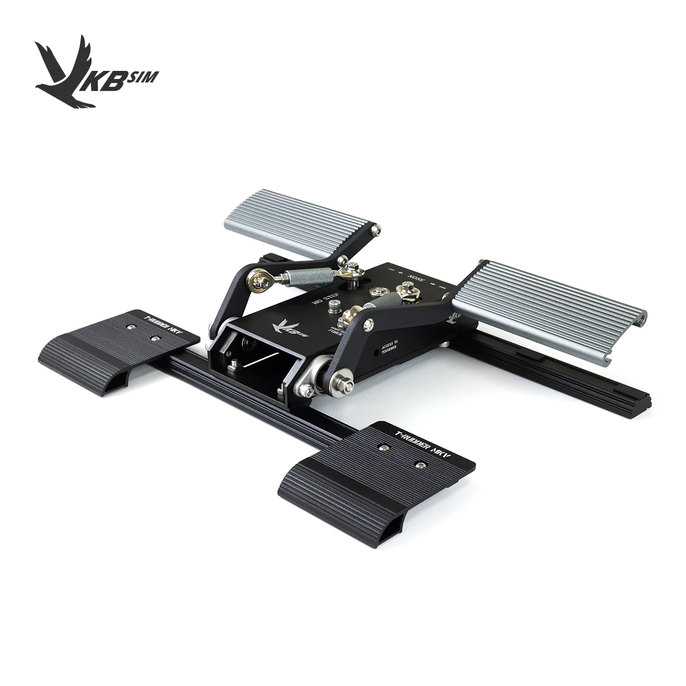

# Sticks & Gamepads

## Recommended

### Logitech Extreme 3D Pro

Great choice for a first joystick to try before you spend hundreds of dollars!

### Xbox or PlayStation gamepad

You may already have one! 

See Tuuvas' setup guides:



([Not suitable for Falcon BMS](https://forum.falcon-bms.com/topic/23233/throttle-up-down-key-bindings-are-too-coarse?_=1683335735387&lang=en-US))

### FlyDigi Vader 3 Pro

Xbox style gamepad with 6 additional mappable buttons and a gyro accurate enough to use as a primary flight control.

### VKB Gladiator NXT EVO Space Combat Edition Premium 

Best value!

### Winwing Orion 2 F-16EX Viper

### Virpil Constellation Alpha grip with WarBRD-D base

### VKB Gunfighter Modern Combat Edition Ultimate

## Recommended with Reservations

### Thrustmaster T16000M FCS

Widely available. Commonly develops problems with axis sensors. Button layout is difficult to use while keeping hands on the HOTAS. Overall similar to the Logitech 3D Extreme Pro, but costs more.

### VKB Gladiator NXT EVO Space Combat Edition Standard

The Premium is worth the extra $30 for the extra hat, trigger and analog stick. However, the Standard may fit within import *de minimis* limits in some European countries.

### VKB Gladiator NXT EVO WWII Combat Edition

Good choice if you only play WWII simulations.

### VKB Gladiator NXT EVO F-14 Combat Edition

Good choice if you only play *DCS: F-14 Tomcat*

### Virpil VPC VFX grip with WarBRD-D base

Good choice if you only play *DCS: F-14 Tomcat*

### CH Products Fighterstick

There are better sticks at MSRP, but you can find these used for a good price. Double check you’re buying the USB version and not the older Game Port version.

### Thrustmaster AVA base with F-16C or F/A-18C grip

Significantly more expensive than an Orion 2. Only consider this if shipping and import fees make it cheaper than a Winwing.

 | 
-|-
|

### RealSimulator F-16 side grip with FSSB-R3 base

For serious F-16 enthusiasts with very high budgets.



### VPForce Rhino

For serious DIYers with extraordinary budgets and patience. Grip not included, requires custom assembly


[https://www.youtube.com/watch?v=QDU5VHS-

## Not Recommended

### Turtle Beach Velocity One Flightstick

Badly designed. Has an inverse force curve making precise inputs and aiming extremely difficult.

### Thrustmaster HOTAS Warthog Flight Stick

Poor gimbal quality, stick is too heavy for the base, you can get much better sticks for less money

### Winwing Orion 2 F/A-18 Hornet

More expensive than the F-16EX Viper grip for fewer buttons. Even if you only play *DCS: F/A-18C Hornet*, you should get the F-16 grip since you’ll want extra buttons for communications. If you play *DCS: F-15E Strike Eagle*, the F-16EX grip is recommended instead to provide an analog input for the WSO’s Hand Controller Unit.

### VKB Gunfighter Modern Combat Edition Pro

The MCE Ultimate fixed a number of criticisms over the MCE Pro and is worth the cost difference.

# Throttles

## Recommended

### VKB STECS

Customizable, best value!

> 💡 The Mini version is intended for use with a separate mount; The Mini Plus/Standard/Max versions can be used as desktop devices out of the box. You can make a desktop plate for the Mini from some scrap wood.

 |  
-|-
|
|

### Winwing Orion 2 F/A-18
    

    
### Winwing Orion 2 F-15EX
    

    

## Recommended with Reservations

### Virpil VPC MongoosT-50CM3

Great quality. Was previously in the Recommended section, but has been surpassed in value by other options like VKB STECS.
    

    
### Virpil VPC CDT-VMAX

Smaller version of the MongoosT-50M3. Great quality, but for most users the VKB STECS is the better value.
    

    
### Thrustmaster TWCS

Widely available. Has [stiction](https://en.wikipedia.org/wiki/Stiction) issues, which can be fixed by [replacing the lubricant](https://www.youtube.com/watch?v=sa0Qb2hq6tQ) or [replacing the slider](https://www.etsy.com/search?explicit=1&q=twcs+slider+mod&ref=s2_trn&order=highest_reviews). Commonly develops issues with the thrust and paddle axes.
    

    
### VKB Gladiator NXT EVO Omni Throttle

A great device for space simulation, which can also be used as a serviceable flight simulation throttle.
    

    
### Thrustmaster HOTAS Warthog throttle

Throttle grip and axis is good. The switches on the base are overly specific to *DCS: A-10C Warthog*. Can be found used for a decent value, but VKB STECS is almost always a better choice. Units made before late 2022 have a poor quality slew control which benefits from a [third-party replacement](https://deltasimelectronics.com/products/thumbstick-slew-sensor-adapter). All versions benefit from the [third-party firmware](https://deltasimelectronics.com/pages/install-instructions).
    

    
### Winwing Orion 2 F-16

If you mostly play *DCS: F-16C Viper, DCS: JF-17 Thunder* and *Falcon BMS*
    

    
### Thrustmaster Viper TQS

If you mostly play *DCS: F-16C Viper, DCS: JF-17 Thunder* and *Falcon BMS* and you live somewhere this is cheaper than a Winwing Orion 2 F-16 throttle
    

    
### Winwing Orion 2 F-15E

If you mostly play *DCS: F-15E Strike Eagle.* Notably, it has a speedbrake switch which the F-15EX grip lacks.
    

    
### VKB GNX WWII Throttle

If you mostly fly WWII aircraft, early to mid cold war aircraft, and/or *DCS MiG-29/Su-25/Su-27/Su-33*
    

    
### CH Products Pro Throttle

Only if you find a *very* good used price. Worse than the Thrustmaster TWCS in every way. Double check you’re buying the USB version and not the older Game Port version.
    
    

# HOTAS (Stick & Throttle Bundles)

## Recommended

### Winwing Orion 2 HOTAS MAX

Bundle of the Winwing Orion 2 F-16EX Viper stick and Orion 2 throttle. Choice of F/A-18, F-15E and F-15EX throttle grips available. A close match to the real controls of an A-10 or F-15E.

 | | 
-|-|-
||

## Recommended with Reservations

### Thrustmaster T16000M FCS HOTAS

Bundle of the Thrustmaster T16000M FCS stick and TWCS throttle
    

    
Winwing Orion 2 HOTAS F-16 Viper: Bundle of the Winwing Orion 2 F-16EX Viper stick and Orion 2. A close match to the real controls of an F-16
    

## Not Recommended

### Thrustmaster T-Flight HOTAS

Designed for game consoles. Too few buttons for simulation use

### Logitech/Saitek X52

Commonly develops axis jitter issues. Production quality seems ti be severely declining, with users who purchased units in the 2020s reporting issues in less than one year.

### Logitech/Saitek X52 Pro

Similar problems to X52

### Logitech X56/Saitek X55

Stick is not terrible but the throttle is very stiff. Worse for the price than buying a VKB Gladiator and Thrustmaster TWCS separately

### Thrustmaster HOTAS Warthog

Bundle of the Thrustmaster HOTAS Warthog flight stick and throttle. See issues with HOTAS Warthog flight stick

### Hori Flight Control System for Windows

This would be fine if it was $200, but Hori is charging $500, and it’s not competitive at that price.

### Turtle Beach VelocityOne Flightdeck

Stick has an inverse force curve making precise inputs and aiming extremely difficult. This might would be fine if it was below $200, but Turtle Beach is charging $400, and it’s not competitive at that price.

# Rudders

Note: Rudders are not mandatory. They are strongly recommended for most helicopters and very useful for WWII aircraft and some Cold War aircraft like the Tomcat, Phantom and Scooter. For modern aircraft, a twist stick is fine.

## Recommended

### VKB T-Rudders

Single axis, no toe brakes
    

    
### Virpil WarBRD/VPC ACE Torq

Single axis, no toe brakes.

 | 
-|-
|

### MFG Crosswind V3
    

    
### Slaw Device pedals
    

    
## Recommended with Reservations

### Winwing Orion Metal Flight Rudder Pedals

Included spring is slightly on the strong side. Otherwise very similar to the MFG Crosswinds, but more expensive and with less customization. May be a good choice for shipping to some regions.
    

    
### CH Products Pro Pedals

Can be found for a good price used. Very narrow.
    

    
### Virpil VPC ACE

Similar to the MFG Crosswind V3. Might be a good choice if you’re buying other Virpil products and can bundle the shipping
    

    
### Thrustmaster TPR

Expensive, some reports of reliability issues
    

    
## Not Recommended

### Logitech/Saitek Pro Flight

Very poor build quality

### Thrustmaster T.Flight

Very poor build quality
