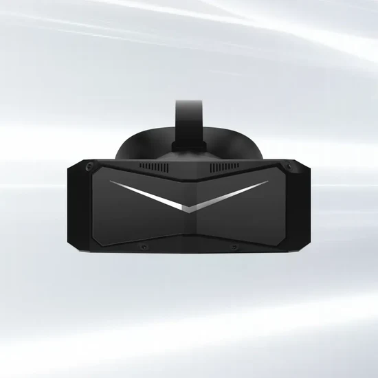
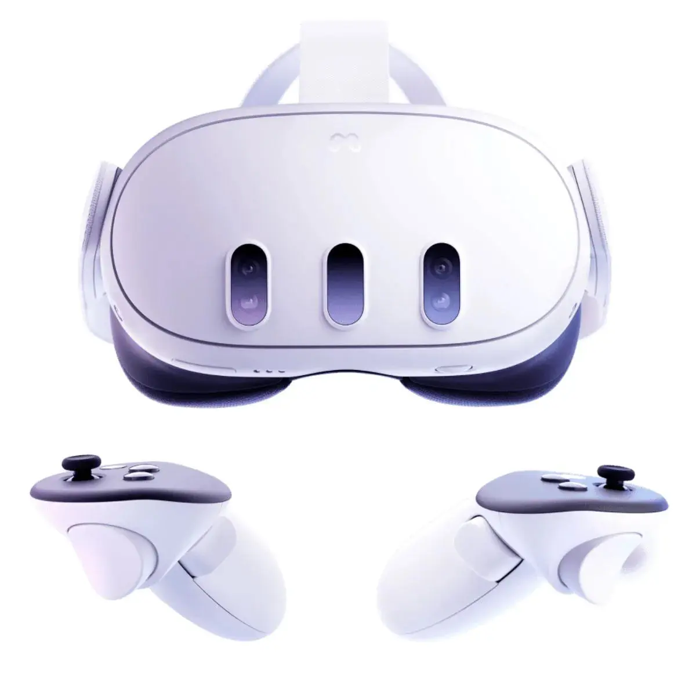
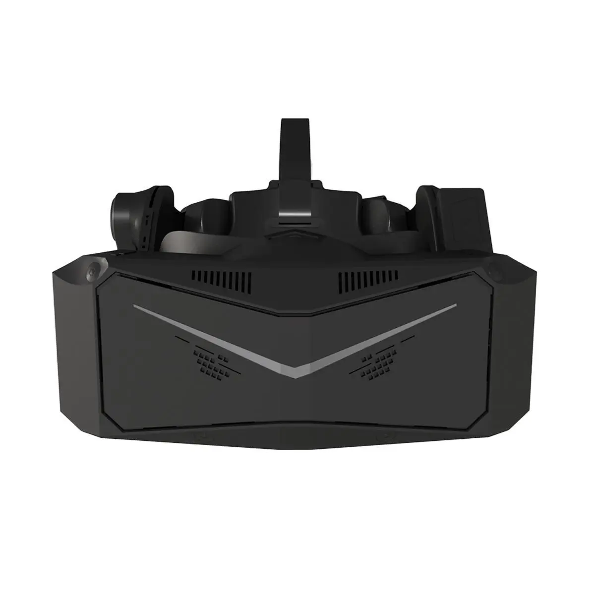

# Abandon All Hope, Ye Who Don Thy Heaset

⚠️ Don’t bother with VR for flight sims unless:
1. You have a very high end PC.
> A **great** VR experience will likely cost you $1000-3000 USD for the headset, PC upgrades, and accessories.
2. You are willing and able to troubleshoot all manner of obscure technical issues.
3. You are comfortable installing software from GitHub and very carefully reading technical instructions written by software engineers.
4. You are OK with your headset breaking for absolutely no fault of your own due to software updates. This includes being OK with headsets becoming permanently bricked and unusuable.
> This is not a hypothetical; it has _already happened_ to the HP Reverb G2 and some Meta Quest headsets.
5. You have a [head tracker](guides/headtracker) to fall back on when updates break VR support from time to time.

## Recommended PC Specs

### Operating System

This guide assumes you are using Windows 11. Windows 10 is missing some features necessary to properly use modern CPUs with heterogenous core layout (e.g. dual CCD, separate performance and efficiency cores).

VR is possible on Linux, but we don't recommend attempting it unless you are a software developer, or at least a very comfortable Linux power user.

### CPU

The best CPUs for VR are AMD X3D series CPUs such as:

- AMD 9800X3D
- AMD 7800X3D
- AMD 7600X3D
- AMD 5800X3D
- AMD 5700X3D
- AMD 5600X3D

However, any fast, high end gaming-oriented CPU is fine. As of current writing, AMD beats Intel in performance across the board, but high end Intel CPUs are acceptable.

Ideally, use an upgraded CPU cooler. We're fans of the Thermaltake's series of budget-friendly air coolers and the Arctic Liquid Freezer III AIO liquid cooler.

## GPU

### Nvida vs AMD vs Intel

For VR, Nvidia is preferable to AMD if the budget allows. Nvidia's GPUs and drivers have signifcantly better software support for VR.

However, if a high-VRAM Nvidia GPU is out of budget or otherwise unavailable, AMD GPUs can be acceptable. You will generally get more performance per dollar with AMD, but won't achieve the same level of performance or compatibility as Nvidia's highest tier GPUs. Note that some VR headsets, such as the MeganeX superlight, are not compatible with AMD GPUs at all.

It is technically possible to use Intel Arc GPUs with certain headsets usch as Meta and Pico, but we don't recommend it for flight sims due to poor performance.

### Recommended GPUs

Tier | Nvidia | AMD |
-|-|-
S+|RTX 5090 |
S|RTX 4090 |
A|RTX 5080, RTX 4080 Super, RTX 5070 Ti, RTX 4080, RTX 3090 Ti, RTX 3090 | 7900 XTX, 7900 XT, 9070XT
B|RTX 5070, RTX 4070 Ti Super, RTX 4070 Ti |  9070†, 7900 GRE, 7800 XT, 6950 XT, 6900 XT
C|RTX 4070 Super, RTX 4070, RTX 3080 Ti, RTX 3080 12GB | 6800 XT

The main things to look for in a GPU for VR are:

- As much VRAM as possible. Ideally 16-32GB. The more the better. **Do not skimp on VRAM!**
- Fast _raster_ performance (i.e. without raytracing or frame generation)
- As much memory bandwidth as possible

Deprioritize:

- Frame generation (DLSS/FSR/XeSS)
- Ray tracing performance

## RAM

Buy a 2x48GB or 2x32GB kit, with the correct compatibility for your CPU and motherboard. Do not use a 4x kit, because they may have stability issue at higher frequencies.

_In most cases_ you can follow this table, but always check with your motherboard manufactuer's recommendations on their website.

|CPU Mfr.|RAM Type|Speed|CAS Latency|Note|
|-|-|-|-|-|
|AMD|DDR5|6000MHz|CL30|
|AMD|DDR4|3600MHz|CL16-18|
|Intel|DDR5|6000-7200MHz|CL26-30|Varies by motherboard - check motherboard documentation!|
|Intel|DDR4|3200-4000MHz|CL16|Diminishing returns past 3200-3600MHz|

See the [RAM section of the DCS performance guide](guides/dcs/performance#ram) for more details.

## PSU

It is important to use a high quality power supply that provides stable power under high load. Wattage and 80PLUS ratings are not enough to tell if a power supply is good or bad.

See the [PSU section of the DCS performance guide](guides/dcs/performance#PSU) for a buyer's guide.

## Recommended Devices

There are no perfect VR headsets, but there are a few worth consideration for flight sims.

We previously recommended the **Pimax Crystal Light** as our primary recommendation and the **Meta Quest 3** as a budget option.

We also recommend using IEMs for audio instead of the mediocre speakers included with most headsets. For budget IEMs, I like the [7HZ x Crinacle Zero:2](https://www.linsoul.com/products/7hz-x-crinacle-zero-2) and [Moondrop CHU II](https://moondroplab.com/en/products/chu-ii). If you have more money, check out the [Crinear Daybreak](https://crinear.com/daybreak).

### [Pimax Crystal Light](https://pimax.com/pages/crystal-light)

**Pros**|
-|
Good field of view (104°x104°)
Excellent display with great pixel density (35 PPD)
Available with or without controllers
Offers both external lighthouse and inside-out tracking options, allowing flexible choice between convenience or tracking fidelity

**Cons**|
-|
Expensive when bundled with controllers or if including the cost of lighthouses
Heavy and bulky, though lighter than the standard Pimax Crytsal
Some users report issues with inside-out tracking
No eye tracking
Mixed experiences with customer support
Medicore microphone and speaker quality

### [Meta Quest 3](https://www.meta.com/quest/quest-3/)

> ⚠️  We do not recommend buying a Quest headset without a warranty. Meta has had issues with mandatory software updates bricking headsets, including out-of-warranty devices.

**Pros**|
-|
Decent field of view (110°x96°)
Relatively affordable
Easy to configure for PCVR use
Good warranty with easy returns/exchanges
Also good for roomscale
Standalone capbilities
Includes controllers
**Cons**|
Requires a quality WiFi5/WiFi6 dedicated router or wireless access point *or* a third party charging+link cable for long sessions
Significantly lower pixel density than our other recommendations (25 PPD)
Significant compression artifacts including image noise and color banding
Forced Oculus/Meta software updates contain breaking changes and sometimes unfixable issues
No eye tracking
Medicore microphone and speaker quality

### [Pimax Crystal](https://pimax.com/crystal/)

**Pros**|
-|
Same Pros as Crystal Light
Excellent eye tracking
**Cons**|
Expensive
Requires a separate battery, even when connected to power source
Heavy and bulky
Similar cons to Crystal Light: Inside-out tracking issues, medicore microphone and speaker quality, mixed customer support experiences

## Why not…?

### Bigscreen Beyond

Bigscreen has announced the [Beyond 2](https://store.bigscreenvr.com/products/bigscreen-beyond-2) and the orignal Beyond is no longer available. Anyone interested in the Beyond should wait for the Beyond 2 instead.

We do not recommend buying a used Beyond:

1. The original Beyond has a non-adjustable IPD, so you would need to have the exact same IPD as the original owner.
2. Many of the Beyond's parts, such as the head cushion, head strap, and connectors to connect to a PC, are forward-compatible with the Beyond 2. Many Beyond owners are listing the non-reusable core for sale, but these are only useful for replacing a broken out-of-warranty Beyond. Therefore, most used Beyond listings are not usable out of the box.

### Meta Quest 3S

> ⚠️  We do not recommend buying a Quest headset without a warranty. Meta has had issues with mandatory software updates bricking headsets, including out-of-warranty devices.

- The Quest 3S is optically identical to the Quest 2, with some additional features such as passthrough and hand tracking, and upgraded onboard hardware.
- Meta uses multiple suppliers for the LCD panel, with significant variance in color and visibly different pixelation. You might get a panel with good color, or one with washed out colors.
- The much better display on the Quest 3 is preferred, but the Quest 3S may be a decent introductory headset if you get it at a good price.
- If you are only interested in PCVR and not standalone VR, consider a used or refurbished Quest 2 instead. It is optically identical to the 3S for PCVR use.

### Meta Quest 2

> ⚠️  We do not recommend buying a Quest headset without a warranty. Meta has had issues with mandatory software updates bricking headsets, including out-of-warranty devices.

- Meta used multiple suppliers for the LCD panel, with significant variance in color and visibly different pixelation. You might get a panel with good color, or one with washed out colors.
- The much better display on the Quest 3 is preferred, but a used or refurbished Quest 2 may be a decent introductory headset if you get it at a good price.

### Meta Quest Pro

> ⚠️  We do not recommend buying a Quest headset without a warranty. Meta has had issues with mandatory software updates bricking headsets, including out-of-warranty devices.

- The Quest 3 is both cheaper and higher resolution.
- On Meta headsets, eye tracking with OpenXR is only available in debug mode. This requires a developer account, which must be verified by Meta. *The author had to send their driver’s license to Meta to pass verification. Your experience may vary.*
- The eye tracking on the Quest Pro is not as good as the Pimax Crystal when used with PC VR. It lags behind your gaze by a few frames. *The author finds this noticeable but tolerable. Your experience may vary.*
- Some users report eye & face tracking hardware failure due to sweat/moisture.
- The slightly better controllers on the Quest Pro compared to the Quest 3 are of limited use for stationary simulations.
- There are *some* advantages - good comfort, ability to see your HOTAS and keyboard through the gap between the headset and your face, and the included controllers are great for roomscale games. But the advantages aren’t worth the tradeoffs for most people, given this price point.
- Awkward middle child between the Meta Quest 3 and Pimax Crystal.

### HTC Vive Focus Vision

- The lenses in the Focus Vision are very poor in quality, resulting in a mostly blurry image.
- General problems with tracking, video stability and eye tracking.
- Probably the worst value headset on the market as of this writing.

### HP Reverb G2

- Microsoft has removed Windows Mixed Reality from Windows, and the G2 relied on WMR to function. (Existing installations continue to work if Windows updates are deferred, but this will become increasingly impractical over time.)
- There is some hope that [Monado](https://monado.freedesktop.org/) will provide support in the future, but this is not guaranteed.
- Very common hardware failures due to internal damage to the proprietary video cable.

### Valve Index

- The Index is severely outdated hardware, overpriced and underperforming compared to the Meta Quest 3 and other current options.

### Apple Vision Pro

- Not officially compatible with OpenXR, which is required for DCS/BMS.
- A workaround is available using ALVR streaming, but it has no guarantees of continuing to work.
- Extremely high price!

## Upcoming Devices

### Bigscreen Beyond 2

We are optimistic that the Beyond 2 will be on our recommended list in late 2025. We have ordered one for testing and will update this guide once we have hands-on experience.

### Pimax Crystal Super

We are watching this one. For now, our recommendation is to wait for independent reviews before deciding whether to purchase.

### Pimax Dream Air

We expect most simmers will prefer the Pimax Crystal models instead. The Dream Air is significantly more expensive while providing a broadly similar PCVR experience. Pimax themselves are marketing the Dream Air as a lightweight and portable device rather than a simulation cockpit device.

### Unannounced Valve headset ("Deckard")

We are currently waiting until we can publicly share more information.

### MeganeX superlight 8K

We are watching this one. It's been having some teething issues with optical
quality and compatibility issues with some RTX 5000 series GPUs. We're unsure if
it will be added to our recommended list at this time, especially compared to
other headsets coming out in 2025 which don't require vendor lock-in to specific
GPUs.

# VR Tweaks

If you use a Virtual Reality headset, there are some additional tweaks and considerations.

## Drivers

In most cases, you should install the latest drivers for your GPU. In some cases a new driver may have a performance issue for VR and you may need to install an older version.

## Prefer DCS Standalone Over Steam

Launching DCS through SteamVR runs the game use the older OpenVR API rather than directly using the OpenXR API. This causes a significant performance hit (though the exact amount may vary by system).



For the best performance, run the Standalone version of DCS directly with VR mode enabled in DCS settings.

If you must use Steam, launch the game normally through the desktop client with VR enabled in DCS settings, rather than through SteamVR.

To convert an existing Steam installation to Standalone:

1. [Download and run the standalone installer](https://www.digitalcombatsimulator.com/en/downloads/world/)
2. Untick "download" at the end of the setup wizard
3. Manually copy or move your files from the Steam installation to the Standalone installation
4. Delete `<DCS standalone installation folder>\Config\retail.cfg`
5. Run the “Repair DCS World” application in your Start Menu

## Remove OpenXR Toolkit

OpenXR Toolkit is discontinued software and should be removed if you previously installed it.

## Quad Views Rendering

[Quad Views Rendering](https://github.com/mbucchia/Quad-Views-Foveated/wiki/What-is-Quad-Views-rendering%3F) is a technique that renders the focus area within your headset at a higher resolution than the rest of the headset. If your headset has eye-tracking, the high-resolution render area will follow your gaze; otherwise, it will be centered within your headset.

> ℹ️ A common misconception is that Quad Views requires eye tracking. While it works _best_ with eye tracking, it is also useful for headsets without eye tracking because you can reduce the resolution at the edges of the display where optical distortion from the headset's lenses blurs the detail anyway.

This can hugely reduce the number of pixels needed to render, improving performance. However, in a combat flight simulator it can also cause problems tracking small, fast moving objects outside of the focus area, such as a dogfight opponent, tracer fire, or the lights on the carrier during a night trap. It may require some tuning and user preference. Results may vary depending on the specific headset and the user’s vision and preferences. If your system is CPU bottlenecked, this might decrease your performance overall.

To try this, use both [Quad Views Foveated](https://github.com/mbucchia/Quad-Views-Foveated) and [Quad Views Companion](https://github.com/TallyMouse/QuadViewsCompanion). The former implements the feature, and the latter provides a GUI for changing the settings in `%localappdata%\Quad-Views-Foveated\settings.cfg`.

Ensure that the following options are enabled in DCS's VR settings as well. **These checkboxes only appear if Quad Views Rendering is installed and DCS is launched with VR enabled.**

- Use Quad Views
- Track the eyes position (if your headset supports eye tracking)

RedKite has a good video demoing eye-tracked Foveated Rendering:



*Note: If you are using a Meta Quest Pro, you’ll need to install [OpenXR Eye Trackers](https://github.com/mbucchia/OpenXR-Eye-Trackers/wiki/Meta-Quest-Pro) to enable eye tracking on PC. You will probably need a verified Developer account.*

## Virtual Desktop or Steam Link

Meta's Airlink streaming application is suboptimal; Since Meta makes money from standalone VR applications sold through the Quest store, their Airlink app for PCVR is a minimal effort with poorly selected video compression settings. Third-party streaming applications can produce better results by more thoughtfully tuning the video stream quality and latency.

[Virtual Desktop](https://www.vrdesktop.net/) is a paid third-party streaming application. Although its primary use case is for displaying 2D content in VR, it also provides advanced options for improved stream quality for VR content. In my testing with Meta Quest devices, I was able to see a higher level of clarity using Virtual Desktop over wifi compared to Meta Quest Link over either USB or wifi. It also recovers from errors better than Quest Link; with Virtual Desktop I can reliably take my headset off, get a drink from the fridge, put my headset back on and resume flight. With Quest Link, I usually had to restart DCS in that situation!

[Steam Link](https://www.meta.com/experiences/steam-link/5841245619310585/) is a free third-party streaming application that works with Meta Quest devices, although it isn't quite as simple to set up as Virtual Desktop.

Your experience may vary depending on your hardware, especially your network bandwidth and wireless access points.

## Meta Quest Link Cable

If you have a Meta Quest headset, and are using Quest Link instead of Virtual Desktop or Steam Link, a link cable will provide better video quality than Quest Link over Wifi, though it will likely be inferior to Virtual Desktop or Steam Link. Meta sells an [official link cable](https://www.meta.com/quest/accessories/link-cable/) if you don’t have one, and more affordable third-party cables are also available.

A tradeoff is that you may not be able to charge your headset and use the link cable at the same time, which may limit how long you can fly at a time. [This third party cable](https://a.co/d/765REiP) allows connecting both a charger and link at once, which extends battery life sufficiently for very long flights.

## Asynchronous Space Warp on Meta Quest Headsets using Quest Link/Airlink

[Asynchronous Space Warp](https://developer.oculus.com/blog/asynchronous-spacewarp/) (ASW) is a technology that improves perceived smoothness in VR, at the tradeoff of locking the framerate to an integer divisor of the headset’s refresh rate. This feature is great if you can maintain your headset’s refresh rate. However, if your framerate dips below the refresh rate even slightly, it will immediately drop to 1/2 the refresh rate. It can also cause judder when using helmet-mounted displays.

On Meta Quest headsets using Quest Link or Airlink, you can toggle ASW while playing with these keys:

| Keybind   | ASW      | Framerate |
| --------- | -------- | --------- |
| Ctrl+Num1 | Disabled | Unlocked  |
| Ctrl+Num2 | Disabled | Locked    |
| Ctrl+Num3 | Enabled  | Locked    |
| Ctrl+Num4 | Auto     | Unlocked  |

> ℹ️ My personal preference is ASW disabled and framerate unlocked (Ctrl+Num1)

## Lower Refresh Rate

You should lock your headset to the _lowest_ refresh rate that you can use comfortably. This helps reduce the visual impact of stuttering. I personally find a refresh rate of 72Hz to work best for me, but if you are impacted by VR sickness or motion sickness, you may need a higher setting such as 90Hz.

## XRNeckSafer

If you find it uncomfortable or painful to twist your torso and neck to look behind you/over your wing, you can use [XRNeckSafer](https://gitlab.com/NobiWan/xrnecksafer) to provide an assist.

## Separate Profiles for 2D and VR
