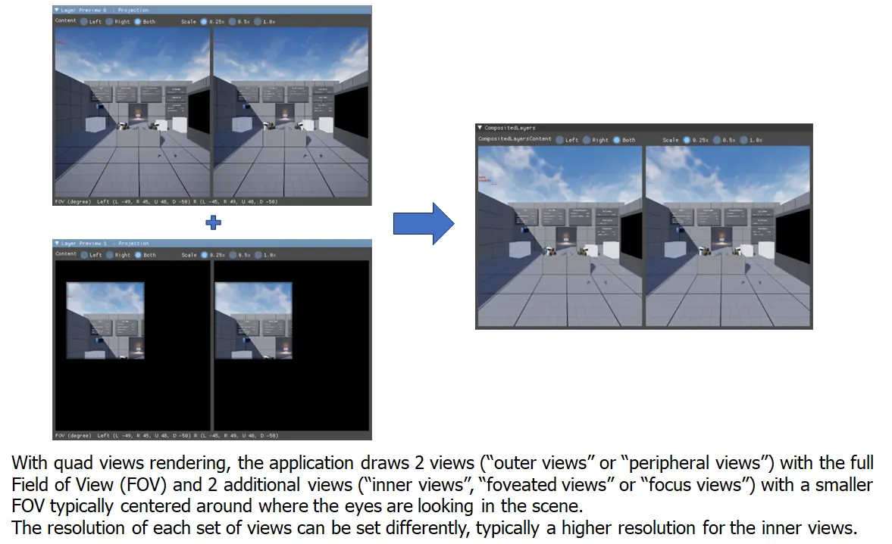

# Abandon All Hope, Ye Who Don Thy Headset and Gaze Into the Abyss

⚠️ Don’t bother with VR for flight sims unless:
1. You have money and time to burn.
> A **great** VR experience will likely cost you $1000-3000 USD for the headset, PC upgrades, and accessories.
2. You have a very high end PC.
3. You are willing and able to troubleshoot all manner of obscure technical issues.
4. You are comfortable installing software from GitHub and very carefully reading technical instructions written by software engineers.
5. You are OK with your headset breaking for absolutely no fault of your own due to software updates. This includes being OK with headsets becoming permanently bricked and unusuable.
> This is not a hypothetical; it has _already happened_ to the HP Reverb G2 and some Meta Quest headsets.
6. You have a [head tracker](guides/headtracker) to fall back on when updates break VR support from time to time.

_This page contains contributions from my friend Lynx._

## Recommended PC Specs

### Operating System

This guide assumes you are using Windows 11. Windows 10 is missing some features necessary to properly use modern CPUs with heterogenous core layout (e.g. dual CCD, separate performance and efficiency cores).

VR is possible on Linux, but we don't recommend attempting it unless you are a software developer, or at least a very comfortable Linux power user.

### CPU

The best CPUs for VR are AMD X3D series CPUs such as:

- AMD 9800X3D
- AMD 7800X3D
- AMD 7600X3D
- AMD 5800X3D
- AMD 5700X3D
- AMD 5600X3D

However, any fast, high end gaming-oriented CPU is fine. As of current writing, AMD beats Intel in performance across the board, but high end Intel CPUs are acceptable.

Ideally, use an upgraded CPU cooler. We're fans of Thermaltake's series of budget-friendly air coolers and the Arctic Liquid Freezer III AIO liquid cooler.

### GPU

#### Nvidia vs AMD vs Intel

For VR, high-VRAM Nvidia GPUs are preferable to AMD GPUs if the budget allows. Nvidia's GPUs and drivers have signifcantly better software support for VR.

However, if a high-VRAM Nvidia GPU is out of budget or otherwise unavailable, AMD GPUs can be acceptable. You will generally get more performance per dollar with AMD, but won't achieve the same level of performance or compatibility as Nvidia's highest tier GPUs.

> Note that some VR headsets, such as the MeganeX superlight, are not compatible with AMD GPUs at all.

It is technically possible to use Intel Arc GPUs with certain headsets usch as Meta and Pico, but we don't recommend it for flight sims due to poor performance.

#### Recommended GPUs

Tier | Nvidia | AMD |
-|-|-
S+|RTX 5090 |
S|RTX 4090 |
A|RTX 5080, RTX 4080 Super, RTX 5070 Ti, RTX 4080, RTX 3090 Ti, RTX 3090 | 7900 XTX, 7900 XT, 9070XT
B|RTX 5070, RTX 4070 Ti Super, RTX 4070 Ti |  9070†, 7900 GRE, 7800 XT, 6950 XT, 6900 XT
C|RTX 4070 Super, RTX 4070, RTX 3080 Ti, RTX 3080 12GB | 6800 XT

The main things to look for in a GPU for VR are:

- As much VRAM as possible. Ideally 16-32GB. The more the better. **Do not skimp on VRAM!**
- Fast _raster_ performance (i.e. without raytracing or frame generation)

Deprioritize:

- Frame generation (DLSS/FSR/XeSS)
- Ray tracing performance

### RAM

Buy a 2x48GB or 2x32GB kit, with the correct compatibility for your CPU and motherboard. Do not use a 4x kit, because they may have stability issue at higher frequencies.

_In most cases_ you can follow this table, but always check with your motherboard manufactuer's recommendations on their website.

|CPU Mfr.|RAM Type|Speed|CAS Latency|Note|
|-|-|-|-|-|
|AMD|DDR5|6000MHz|CL30|
|AMD|DDR4|3600MHz|CL16-18|
|Intel|DDR5|6000-7200MHz|CL26-30|Varies by motherboard - check motherboard documentation!|
|Intel|DDR4|3200-4000MHz|CL16|Diminishing returns past 3200-3600MHz|

See the [RAM section of the DCS performance guide](guides/dcs/performance#ram) for more details.

### PSU

It is important to use a high quality power supply that provides stable power under high load. Wattage and 80PLUS ratings are not enough to tell if a power supply is good or bad.

See the [PSU section of the DCS performance guide](guides/dcs/performance#PSU) for a buyer's guide.

## Recommended Headsets

There are no perfect VR headsets, but there are a few worth consideration for flight sims.

_These recommendations are for flight simulation use. Some of these devices are good for other applications; we mainly evaluate whether they are good choices for flight sims._

We **are likely to recommend** these upcoming devices:

- [Bigscreen Beyond 2](../../reviews/vr/bigscreen-beyond-2)
- [Pimax Crystal Super](../../reviews/vr/pimax-crystal-super)

We **previously recommended** these devices, but now recommend waiting for the above upcoming devices:

- [Pimax Crystal](../../reviews/vr/pimax-crystal)
- [Pimax Crystal Light](../../reviews/vr/pimax-crystal-light)

We **only reluctantly recommend** these devices for those on a budget:

- [Meta Quest 3](../../reviews/vr/meta-quest-3)

[See all of our reviews here](../../../reviews)!

## Recommended Audio

We also recommend using IEMs for audio instead of the mediocre speakers included with most headsets. For budget IEMs, I like the [7HZ x Crinacle Zero:2](https://www.linsoul.com/products/7hz-x-crinacle-zero-2) and [Moondrop CHU II](https://moondroplab.com/en/products/chu-ii). If you have more money, check out the [Crinear Daybreak](https://crinear.com/daybreak).

## VR Tweaks

If you use a Virtual Reality headset, there are some additional tweaks and considerations.

### Drivers

In most cases, you should install the latest drivers for your GPU. In some cases a new driver may have a performance issue for VR and you may need to install an older version.

### Quad Views Rendering

[Quad Views Rendering](https://github.com/mbucchia/Quad-Views-Foveated/wiki/What-is-Quad-Views-rendering%3F) is a technique that renders the focus area within your headset at a higher resolution than the rest of the headset. If your headset has eye-tracking, the high-resolution render area will follow your gaze; otherwise, it will be centered within your headset.

> ℹ️ A common misconception is that Quad Views requires eye tracking. While it works _best_ with eye tracking, it is also useful for headsets without eye tracking because you can reduce the resolution at the edges of the display where optical distortion from the headset's lenses blurs the detail anyway.

This can hugely reduce the number of pixels needed to render, improving performance. However, in a combat flight simulator it can also cause problems tracking small, fast moving objects outside of the focus area, such as a dogfight opponent, tracer fire, or the lights on the carrier during a night trap. It may require some tuning and user preference. Results may vary depending on the specific headset and the user’s vision and preferences. If your system is CPU bottlenecked, this might decrease your performance overall.

To try this, use both [Quad Views Foveated](https://github.com/mbucchia/Quad-Views-Foveated) and [Quad Views Companion](https://github.com/TallyMouse/QuadViewsCompanion). The former implements the feature, and the latter provides a GUI for changing the settings in `%localappdata%\Quad-Views-Foveated\settings.cfg`.

Ensure that the following options are enabled in DCS's VR settings as well. **These checkboxes only appear if Quad Views Rendering is installed and DCS is launched with VR enabled.**

- Use Quad Views
- Track the eyes position (if your headset supports eye tracking)

RedKite has a good video demoing eye-tracked Foveated Rendering:



*Note: If you are using a Meta Quest Pro, you’ll need to install [OpenXR Eye Trackers](https://github.com/mbucchia/OpenXR-Eye-Trackers/wiki/Meta-Quest-Pro) to enable eye tracking on PC. You will probably need a verified Developer account.*

### Lower Refresh Rate

You should lock your headset to the _lowest_ refresh rate that you can use comfortably. This helps reduce the visual impact of stuttering. I personally find a refresh rate of 72Hz to work best for me, but if you are impacted by VR sickness or motion sickness, you may need a higher setting such as 90Hz.

### XRNeckSafer

If you find it uncomfortable or painful to twist your torso and neck to look behind you/over your wing, you can use [XRNeckSafer](https://gitlab.com/NobiWan/xrnecksafer) to provide an assist.

### Remove OpenXR Toolkit

OpenXR Toolkit is discontinued software and should be removed if you previously installed it.

### Meta-Specific Tweaks

On Meta headsets (Quest 3, Quest 3S, Quest Pro, Quest 2), see our [Meta-specifc tweak guide](tweaks/meta).

### DCS-Specific Tweaks

For tweaks specific to DCS, see the [VR Tweaks section of the DCS Performance Guide](guides/dcs/performance#vr-tweaks)

 
 
 
 
 
 
 
 
 
 
 
 
 
 
 
 
 
 
 
 
 
 
 
 
 
 
 
 
 
 
 
 

_This space intentionally left blank._
