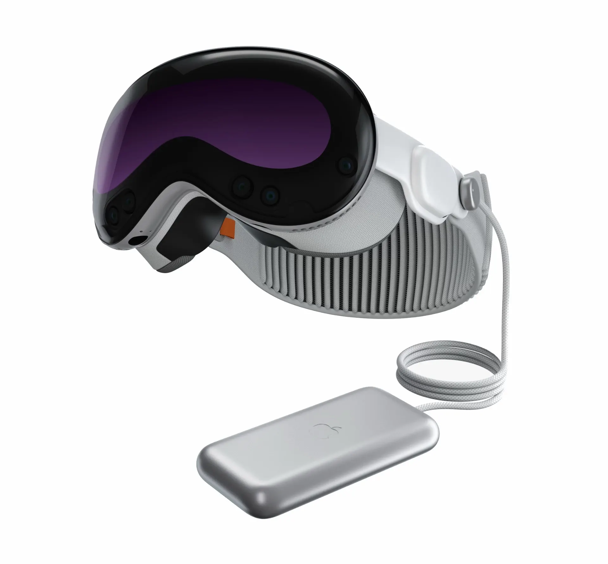

TLDR: We do not recommend the Apple Vision Pro for flight sims because of its high price.

We have not purchased or demoed this headset ourselves. This review contains information from online sources.

The Apple Vision Pro is an interesting personal productivity and entertainment device, especially for people who are already within the Apple ecosystem. It does not officially support OpenXR, but apps are available on the App Store that provide support via [ALVR](https://github.com/alvr-org/ALVR), which can be used to make PC flight sims work with the headset.

Ultimately, we think the Apple Vision Pro's price is far too high to justify for most flight simmers.
