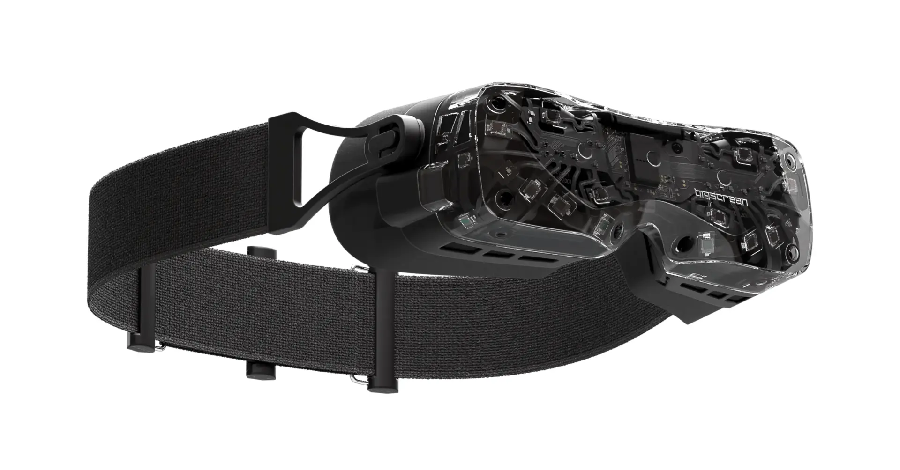

**As of early October 2025, we have received our Bigscreen Beyond 2 purchased with our own money. We will post a longer review after using it for a while.**

Our first impressions:

- The brightness of the display is mediocre, in a way that impacts gameplay in some titles and scenes
- The severe glare/bloom in dark scenes is terrible. Some scenes, such as mission briefings in Project Wingman and the SteamVR menu, are pretty much unwatchable. Others, such as dark night flights in DCS World, are annyoing but playable.
- We hit a few setup snags, including one issue for which the fix was documented no where except the Bigscreen Discord.
- Otherwise, the experience has been positive so far. The small size of the unit is incredibly impressive. The display clarity and performance experience have so far been good. However, we need to continue testing to further evaluate the headset.
