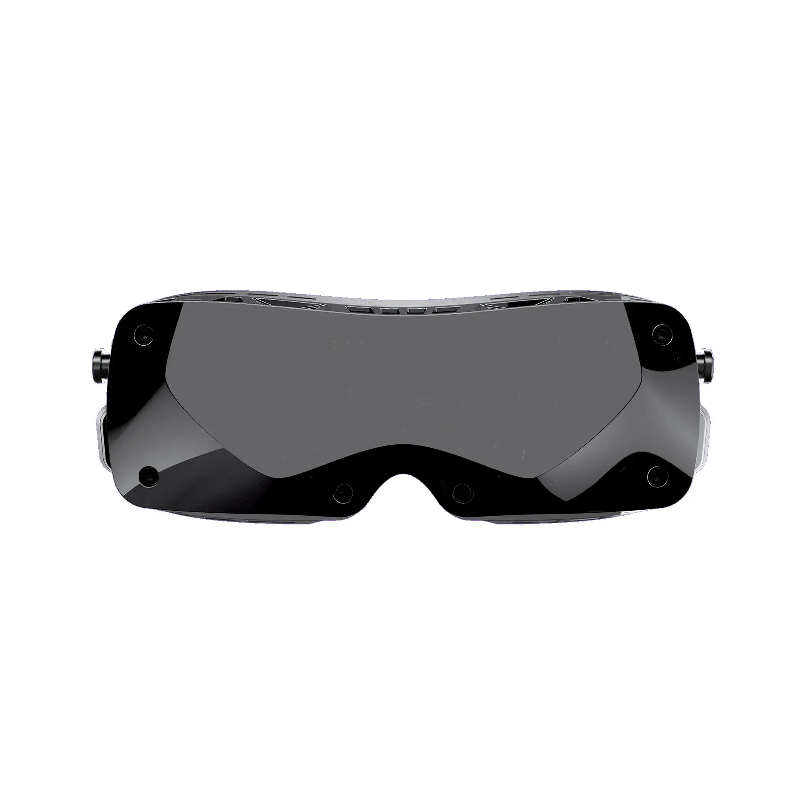

TL;DR: Buy the [Bigscreen Beyond 2](../../reviews/vr/headsets/bigscreen-beyond-2/) instead.

**We purchased this headset with our own money for this review.**

Bigscreen has announced the [Beyond 2](https://store.bigscreenvr.com/products/bigscreen-beyond-2) and the orignal Beyond is no longer available.

We do not recommend buying a used Beyond:

1. The original Beyond has a non-adjustable IPD, so you would need to have the exact same IPD as the original owner.
2. Many of the Beyond's parts, such as the head cushion, head strap, and connectors to connect to a PC, are forward-compatible with the Beyond 2. Many Beyond owners are listing the non-reusable core for sale, but these are only useful for replacing a broken out-of-warranty Beyond. Therefore, most used Beyond listings are not usable out of the box.
