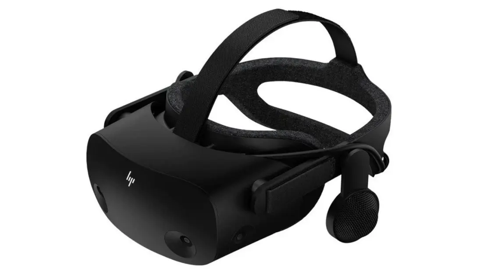

TL;DR: We do not recommend the HP Reverb G2.

**We purchased this headset with our own money for this review.**

Microsoft has removed Windows Mixed Reality from Windows, and the G2 relied on WMR to function. [An open source developer is working on a replacement driver](https://www.youtube.com/watch?v=YhNzIoGNm4o). This driver is not yet available publicly, and will only support Nvidia GPUs.

The G2's video cable is fragile and has a high failure rate. It is not replaceable or user-serviceable, so if it fails, the headset is effectively bricked.
