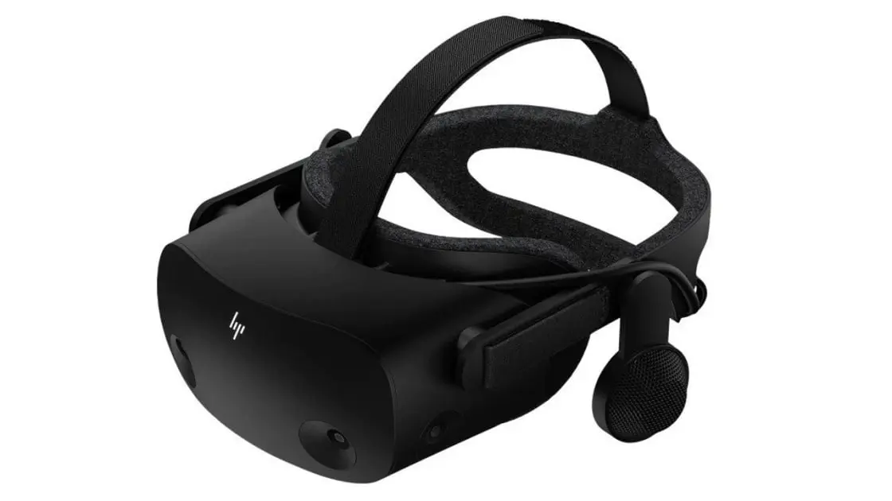

**We purchased this headset with our own money for this review.**

Note: The Reverb G2 requires [Oasis VR](https://store.steampowered.com/app/3824490/Oasis_Driver_for_Windows_Mixed_Reality/) to function on current versions of Windows.

We like using the Reverb G2. It has high enough resolution and good enough tracking to read the cockpit displays in DCS World.

Unfortunately, the G2's video cable is fragile and has a high failure rate. It is not replaceable or user-serviceable, so if it fails, the headset is effectively bricked.

If you see a cheap working G2 on your local classifieds, it might be worth buying. Just expect it to eventually fail.
