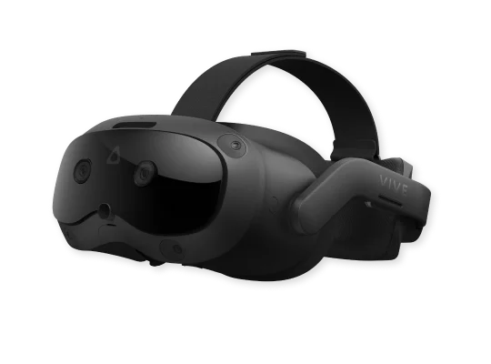

TL;DR: We do not recommend the HTC Vive Focus Vision.

- The lenses in the Focus Vision are very poor in quality, resulting in a mostly blurry image.
- General problems with tracking, video stability and eye tracking.
- Probably the worst value headset on the market as of this writing.
