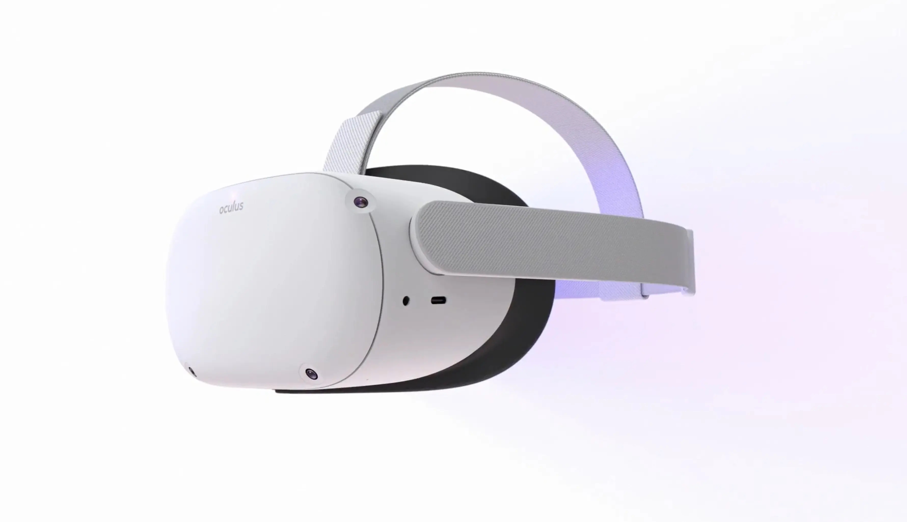

TL;DR: We no longer recommend the Meta Quest 2.

**We purchased this headset with our own money for this review.**

> ⚠️  We do not recommend buying a Quest headset without a warranty. Meta has had issues with mandatory software updates bricking headsets, including out-of-warranty devices.

# Pros

- Can sometimes be found used for very cheap

# Cons

- The Quest 2's screen is outdated, and too blurry to see cockpit gauges.
- [Meta's Quest Link software is a pain for flight simmers.](../../../guides/vr/meta)
- Meta used multiple suppliers for the Quest 2 LCD panel, with significant variance in color and visibly different pixelation. You might get a panel with good color, or one with washed out colors.
