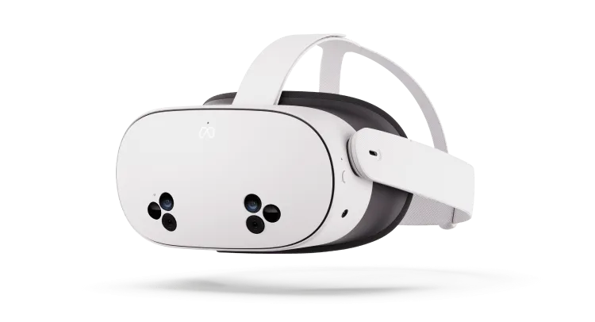

TL;DR: We do not recommend the Meta Quest 3S for flight simmers.

> ⚠️  We do not recommend buying a Quest headset without a warranty. Meta has had issues with mandatory software updates bricking headsets, including out-of-warranty devices.

- The Quest 3S is optically identical to the [Quest 2](guides/vr/headsets/meta-quest-2), with some additional features such as passthrough and hand tracking, and upgraded onboard hardware.
- [Meta's Quest Link software is a pain for flight simmers.](../../../guides/vr/tweaks/meta)
- Meta uses multiple suppliers for the LCD panel, with significant variance in color and visibly different pixelation. You might get a panel with good color, or one with washed out colors.
