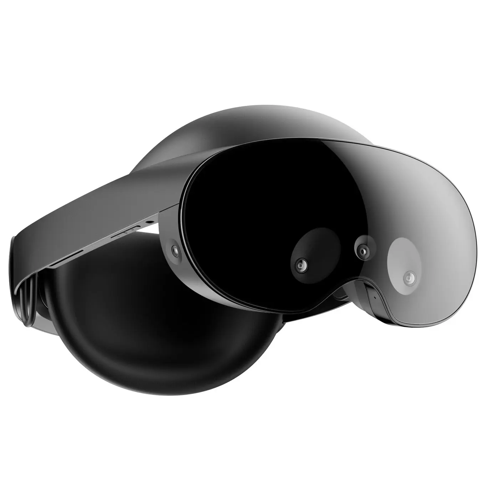

TL;DR: We do not recommend the Meta Quest Pro for flight simmers.

**We purchased this headset with our own money for this review.**

> ⚠️  We do not recommend buying a Quest headset without a warranty. Meta has had issues with mandatory software updates bricking headsets, including out-of-warranty devices.

# Pros

- Good comfort
- You can see your HOTAS and keyboard through the gap between the headset and your face

# Mixed

- Eye tracking with OpenXR is only available in debug mode. This requires a developer account, which must be verified by Meta. *The author had to send their driver’s license to Meta to pass verification. Your experience may vary.*
- The eye tracking on the Quest Pro is not as good as other headsets when used with PC VR. It lags behind your gaze by a few frames. *The author finds this noticeable but tolerable. Your experience may vary.*

# Cons

- The Quest Pro is lower resolution than modern headsets, including the [Quest 3](guides/vr/headsets/meta-quest-3).
- [Meta's Quest Link software is a pain for flight simmers.](../../../guides/vr/tweaks/meta)
- High price point!
- Some users report eye & face tracking hardware failure due to sweat/moisture.
- My Quest Pro controllers also bricked themselves in less than a year, becoming completely unusable.
- Overall, an awkward middle child. It's not a budget headset like the Quest 3, and it's not in the same class as high end headsets from Pimax or Bigscreen.
