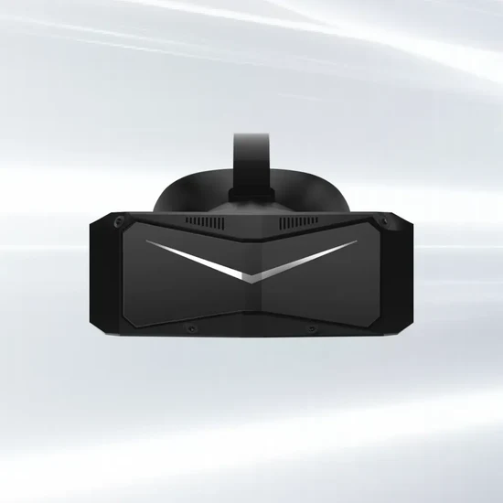

TL;DR We used to recommend the Pimax Crystal Light (and [Crystal](../pimax-crystal)) as one of our top picks for a high-end VR headset. However, we now recommend waiting for reviews for the [Pimax Crystal Super](../pimax-crystal-super) and [Bigscreen Beyond 2](../bigscreen-beyond-2).

# Pros

- Good field of view (104°x104°)
- Excellent display with great pixel density (35 PPD)
- Available with or without controllers
- Offers both external lighthouse and inside-out tracking options, allowing flexible choice between convenience or tracking fidelity

# Cons

- Expensive when bundled with controllers or if including the cost of lighthouses
- Heavy and bulky, though lighter than the standard [Pimax Crystal](../pimax-crystal)
- Some users report issues with inside-out tracking
- No eye tracking
- Mixed experiences with customer support
- Medicore microphone and speaker quality
