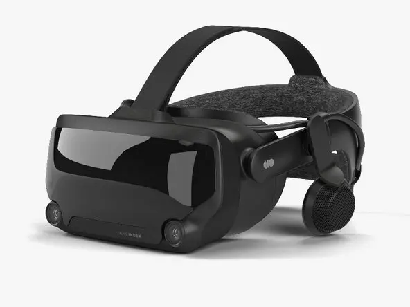

TL;DR: We no longer recommend the Valve Index for flight sims.

**We purchased this headset with our own money for this review.**

# Pros

- Reliable
- Great software with easy compatibility with many VR games

# Cons

- Extremely outdated - around six years old now without any updates
- Outdated, blurry screen
- _Severely_ overpriced
